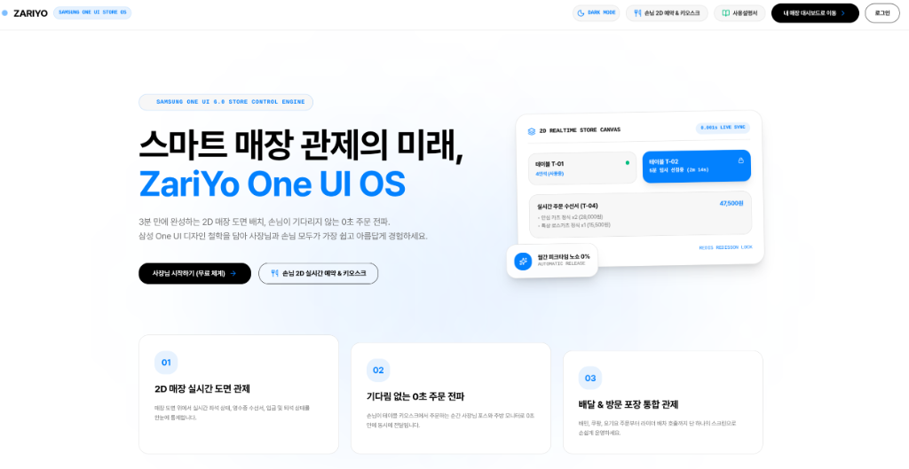

# 자리요 (ZariYo) - 차세대 실시간 2D 공간 관제 & 무인 키오스크/테이블 오더 통합 시스템


<br/>

<div align="center">
  
</div>

<br/>

> **자리요(ZariYo)**는 관리자(매장 오너)가 2D GUI 드래그 앤 드롭 캔버스를 통해 매장 레이아웃과 좌석 배치를 자유롭게 설계하고, 손님은 휴대폰 간편 인증 및 카카오 소셜 로그인을 바탕으로 실시간 2D 공간 예약, 무인 주문 및 결제, 직원 호출 서비스를 통합하여 이용할 수 있는 차세대 풀스택 공간 제어 및 스마트 오더 솔루션입니다.

---

## 1. 프로젝트 상세 소개 및 기획 배경

### 서비스 기획 배경 및 해결하고자 하는 문제 (Pain Points)
전통적인 식음료(F&B) 매장, 공유 오피스, 독서실, 스터디 카페 등 다양한 공간 자원을 운영하는 환경에서는 다음과 같은 고질적인 문제점과 운용상의 비효율성이 존재했습니다.

1. **유연하지 못한 공간 레이아웃 관리 및 높은 변경 비용**:
   - 매장의 인테리어 변경, 팝업 행사, 시즌별 좌석 재배치 발생 시 기존 시스템에서는 엔지니어나 개발자의 도움 없이 도면 데이터를 실시간 수정하기 어려웠습니다.
2. **좌석 선점 중복 및 결제 과정에서의 트랜잭션 충돌**:
   - 동시간대 다수의 사용자가 동일한 좌석을 동시에 선택할 경우, 결제 단계에서 좌석이 겹치거나 데이터 무결성이 깨지는 문제(Race Condition)가 빈번히 발생했습니다.
3. **손님 이용 허들 및 복잡한 회원가입 절차**:
   - 현장 방문 고객에게 아이디와 비밀번호 기반의 회원가입을 요구하는 것은 이용 만족도를 저하시키고 주문 이탈률을 높이는 주요 원인이었습니다.
4. **실시간 관제 및 주문-주방(KDS) 연동의 부재**:
   - 주문 내역과 직원 호출 요청이 매장 관제판에 즉각 반영되지 않아 서빙 지연 및 운영 병목이 발생했습니다.

### 자리요(ZariYo)의 핵심 해결책 (Solutions)
자리요는 이러한 문제점을 극복하기 위해 하이브리드 아키텍처(Redis + MySQL)와 실시간 이원화 웹소켓(WebSocket STOMP) 통신 체계를 도입했습니다.

- **직관적인 2D GUI 공간 건축 마법사**: 마우스 드래그 앤 드롭으로 카운터, 입구, 테이블, 바석 등을 실시간으로 배치 및 수정하고 이를 JSON 좌표 데이터 구조로 변환해 동기화합니다.
- **Redis Redisson 분산 락 기반 5분 임시 선점 시스템**: 동시성 제어 기술을 통해 0.001초 단위의 동시 접근을 제어하고, 선점 성공 시 300초(5분)의 TTL을 부여하여 결제 진행 중 좌석을 안전하게 보호합니다.
- **카카오 OAuth 2.0 소셜 로그인 & 무가입 방문 인증**: 카카오 원클릭 소셜 로그인 및 휴대폰 번호 기반 방문 로그 릴레이 파이프라인을 구축하여 고객 접근성을 극대화했습니다.
- **Pretendard Variable 기반 최우선 서체 & 초고화질 가독성 UX**: 안티에일리어싱(`-webkit-font-smoothing`), 최적 한글 자간(`-0.018em`), 행간(`1.55`), 단어 단위 잘림 방지(`word-break: keep-all`)를 전역 적용하여 렌더링 선명도를 극대화했습니다.
- **실전 사용설명서 & 셋업 가이드북 (`/guide`)**: 매장 2D 드래그 배치, 대시보드 관제, 키오스크 이용순서 및 현장 운영 트러블슈팅 FAQ를 포함한 인터랙티브 가이드를 내장했습니다.

---

## 2. 주요 핵심 기능 상세

### 🔒 Redis Redisson 분산 락 동시성 제어 (5분 원자성 선점)
- **상호 배제(Mutual Exclusion) 보장**: Redis 분산 락(RLock)을 활용해 동일 좌석에 대한 중복 요청을 원천 차단합니다.
- **자동 데드락 방지**: `tryLock(5s, 10s)` 타임아웃 설정을 적용해 시스템 장애 시 10초 후 락이 자동 해제되도록 안전장치를 구축했습니다.
- **5분 TTL 공석 자동 원복**: 선점 후 5분 이내 미결제 시 노쇼 방지를 위해 자동으로 좌석이 공석으로 원복됩니다.

### 🖼️ 사장님 2D GUI 스토어 빌더 (`/owner/store/builder`)
- **드래그 앤 드롭 캔버스**: 2인석, 4인석, 바 테이블, 카운터, 출입구 위치를 1분 만에 시각적으로 배치합니다.
- **속성 및 락 설정**: 테이블 식별 번호(예: T-01), 식별 라벨, 예약 가능 여부 및 5분 임시 선점 타임아웃 락 여부를 커스텀 편집합니다.

### 🖥️ 사장님 실시간 관제 대시보드 (`/owner/dashboard`)
- **2D 라이브 지도 관제**: 초록(공석), 주황(5분 선점 진행 중), 파랑(착석 완료), 빨강(노쇼/경고) 등 실시간 좌석 현황을 한눈에 파악합니다.
- **인라인 테이블 제어**: 테이블 클릭 시 팝업을 통해 [강제 공석 처리], [입정 확정], [퇴실 완료], [좌석 이동]을 수동 조치합니다.
- **알림 센터 드로어**: 실시간 선점 신호, 결제 완료, 5분 타임아웃 만료 알림을 실시간 스트리밍으로 수신합니다.

### 📱 손님 2D 키오스크 & 좌석 예약 (`/reserve`)
- **4단계 릴레이 순차 UX**: 휴대폰 번호 입력 ➔ 매장 선택 ➔ 2D 좌석 선택/5분 선점 락 ➔ 메뉴 및 옵션 선택 ➔ 주문 결제 과정 제공.
- **실시간 좌석 변경**: 주문 완료 후 손님이 원하는 경우 빈 테이블로 원터치 좌석 이동을 제어합니다.

### 🍳 주방 KDS (Kitchen Display System) & 배달 릴레이
- **2분할 관제 뷰**: 주방 태블릿 모니터에서 홀 주문과 배달 주문을 2분할 릴레이 카드로 수신합니다.
- **실시간 품절(Sold-Out) 스위치**: 재료 소진 시 버튼 클릭 1초 만에 전 키오스크 및 배달 플랫폼 메뉴판에 품절 상태를 동기화합니다.

### 📘 실전 이용 & 셋업 가이드 매뉴얼 (`/guide`)
- **역할/상황별 탭 매뉴얼**: 사장님 셋업, 대시보드 관제, 키오스크 이용, 주방 KDS 릴레이 가이드를 탭 인터페이스로 상세 안내합니다.
- **실전 트러블슈팅 FAQ**: 재배치 조치, 미결제 강제 공석 조치, 품절 설정 방법 등 현장 응급 조치 팁을 제공합니다.

---

## 3. 기술 스택 및 시스템 아키텍처

### Frontend
- **Core Framework**: React 19, TypeScript, Vite
- **Typography & Styling**: Pretendard Variable, Vanilla Tailwind CSS v4, Lucide Icons, Framer Motion
- **Map & Geocoding Engine**: Leaflet OpenStreetMap API, Google Maps JavaScript API
- **Realtime Networking**: @stomp/stompjs, sockjs-client, Axios

### Backend & Infrastructure
- **Core Framework**: Java 17, Spring Boot 3.3.1, Spring Data JPA, Spring Security 6
- **Database Layer**: MySQL 8.0 (Relational Data), Redis 7.2 (Cache & Redisson Distributed Lock)
- **Security & Auth**: OAuth 2.0 (Kakao), JWT (30분 Access Token / 7일 Refresh Token)
- **API Documentation**: OpenAPI 3 (Springdoc Swagger UI)
- **Virtualization**: Docker Compose (MySQL 3306, Redis 6379)

---

## 4. 백엔드 8대 코어 도메인 API 명세

| 도메인 | 주요 엔드포인트 | 상세 설명 |
| :--- | :--- | :--- |
| **Auth (인증/OAuth)** | `POST /api/v1/auth/kakao`, `POST /api/v1/auth/login`, `POST /api/v1/auth/refresh` | 카카오 소셜 로그인, 일반 로그인, 30분 Access Token Silent Refresh |
| **Admin (어드민)** | `GET /api/v1/admin/users`, `PATCH /api/v1/admin/users/{id}/status` | 전역 회원 목록 조회 및 계정 상태/역할 제어 |
| **Store (매장)** | `POST /api/v1/stores`, `GET /api/v1/stores/owner/{id}` | 2D 캔버스 좌표 레이아웃 저장 및 사장님별 매장 정보 조회 |
| **Seat (좌석)** | `GET /api/v1/seats`, `POST /api/v1/seats/reserve` | 실시간 좌석 상태 조회 및 Redis Redisson 5분 임시 선점 |
| **Reservation (예약)**| `POST /api/v1/seats/confirm` | 결제 완료 후 영속 DB(MySQL)에 예약 최종 확정 |
| **Menu (메뉴)** | `GET /api/stores/{id}/categories`, `PUT /api/menus/{id}/sold-out` | 메뉴 카테고리, 항목, 옵션 등록 및 원클릭 실시간 품절 처리 |
| **Order (주문)** | `POST /api/stores/{id}/orders`, `PATCH /api/orders/{id}/status` | 무인 결제 주문 접수 및 KDS 조리/서빙/완료 상태 체인 |
| **StaffCall (직원호출)**| `POST /api/stores/{id}/staff-calls`, `PATCH /api/staff-calls/{id}/resolve`| 편의 서비스 요청 접수 및 관제 조치 완료 처리 |

- **Swagger UI 명세서 접속 주소**: `http://localhost:8080/swagger-ui/index.html`
- **ERD Cloud 상세 DB 설계도**: [ERD Cloud 실시간 상세 설계도 링크](https://www.erdcloud.com/d/U9aEisdM)

---

## 5. 프로젝트 디렉토리 구조

```
ZariYo/
├── docs/assets/             # 사용자 직접 전달 원본 스크린샷 자산 (zariyo_real_landing.png)
├── ZariYo-FrontEnd/         # React 19 + Vite + TypeScript 프론트엔드
│   ├── src/
│   │   ├── api/            # REST API 통합 클라이언트
│   │   ├── components/     # 2D 캔버스, 가이드, 대시보드, 키오스크, 지오코딩 지도
│   │   ├── hooks/          # useWebSocket, useStoreBuilder, useDashboard, useKioskOrder
│   │   ├── pages/          # 랜딩, 어드민, 사장님 대시보드/빌더, 손님 예약, 가이드
│   │   └── index.css       # Pretendard Variable & Tailwind v4 전역 Typography
├── ZariYo-BackEnd/          # Spring Boot 3.3.1 백엔드
│   ├── src/main/java/com/zariyo/
│   │   ├── domain/         # user, store, seat, reservation, menu, order, staffcall
│   │   └── global/         # Security 6, JWT, Redisson, WebSocket STOMP, Exception
│   └── .env                # 백엔드 시크릿 환경변수 (Git 추적 제외)
├── study-notes/             # 일자별 기술 학습 노트 (2026-07-07 ~ 2026-08-04)
├── docker-compose.yml       # MySQL 8.0 & Redis 7.2 로컬 가상화 컨테이너
├── work.md                  # 마일스톤 및 175단계 전체 개발 일지
└── trouble.md               # 문제 해결 및 트러블슈팅 이력 (43개 항목)
```

---

## 6. 빠른 시작 가이드 (Quick Start)

### 1. 백엔드 시크릿 환경변수 (`ZariYo-BackEnd/.env`) 작성
```env
KAKAO_CLIENT_ID=your_kakao_rest_api_key
KAKAO_CLIENT_SECRET=your_kakao_client_secret
KAKAO_REDIRECT_URI=http://localhost:5173/auth/kakao/callback
JWT_SECRET=your_custom_jwt_secret_key_base64
```

### 2. 백엔드 인프라 (MySQL & Redis) 구동
```bash
docker-compose up -d
```

### 3. 백엔드 Spring Boot 서버 구동
```bash
cd ZariYo-BackEnd
./gradlew bootRun
```

### 4. 프론트엔드 개발 서버 구동
```bash
cd ZariYo-FrontEnd
pnpm install
pnpm run dev
```
