# 자리요 (ZariYo) 기술 분석 및 코드 리팩토링 평가 보고서

이 보고서는 '자리요' 스마트 오피스/도서관 통합 예약 및 모니터링 시스템의 현재 프론트엔드 정적 목업 코드를 진단하고, 기획 설계서(README/Notion) 상에 기술된 백엔드 및 데이터베이스와의 유기적 연결성, 리팩토링 수준, 그리고 보안성을 분석하여 향후 개발 로드맵을 제언합니다.

---

## 1. 백엔드 및 DB 연결성 분석

현재 단계는 **'순수 목업(Mockup) 정적 페이지 단계'**로 진행 중이므로, 프론트엔드 코드 내에 실제 데이터베이스 드라이버나 백엔드 REST API 통신 모듈(`axios` 실연동 등)이 직접 구현되어 있지는 않습니다. 그러나 기획 명세 및 아키텍처 다이어그램을 바탕으로 설계된 백엔드와 DB와의 연결성은 매우 체계적으로 구조화되어 있습니다.

### 🔄 데이터 연동 아키텍처 분석

```mermaid
sequenceDiagram
    autonumber
    actor Client as 클라이언트 (React)
    participant WAS as 백엔드 (Spring Boot)
    participant Redis as 분산 캐시 (Redis)
    participant DB as 관계형 DB (MySQL)

    Client->>WAS: 좌석 예약 신청 (POST /api/v1/seats/reserve)
    rect rgb(20, 20, 30)
        Note over WAS, Redis: 동시성 제어 (Redisson 분산 락)
        WAS->>Redis: 5분 임시 선점 (SET seat:lock EX 300 NX)
        Redis-->>WAS: 락 획득 성공 완료
    end
    WAS-->>Client: 임시 예약 완료 통지 (200 OK)
    
    Note over Client, WAS: 5분 이내 결제 시도
    Client->>WAS: 최종 예약 확정 요청 (POST /api/v1/seats/confirm)
    WAS->>DB: 영속성 데이터 반영 (INSERT INTO reservation)
    DB-->>WAS: 커밋 완료
    WAS->>Redis: 임시 선점 락 해제 (DEL seat:lock)
    WAS-->>Client: 예약 최종 확정 완료 (200 OK)
```

### 🗄️ 백엔드 & DB 연결성 평가
1. **Redis 활용을 통한 동시성 완화 (임시 선점)**
   - 다중 노드로 구성된 분산 WAS 환경에서 발생할 수 있는 중복 예약 문제를 해결하기 위해 **Redis Redisson 분산 락**을 활용하는 기획은 훌륭합니다.
   - 단일 데이터베이스(MySQL)에 부하가 가기 전에 고속 In-Memory 데이터 스토어(Redis) 단에서 선점 만료 시간(TTL 5분)을 처리함으로써 DB I/O 병목 현상을 효율적으로 사전에 차단합니다.
2. **하이브리드 스토리지 시너지**
   - 휘발성이 강한 실시간 상태 정보는 **Redis**가 전담하고, 금융 결제 정보 및 영속성이 보장되어야 하는 최종 예약 이력 데이터는 **MySQL** RDB로 분산 보관하여 영속성(durability)과 속도(speed)를 동시에 챙겼습니다.
3. **실시간 싱크 채널 (WebSocket & SSE)**
   - 사용자가 페이지를 새로고침 하지 않아도 좌석 배치의 변경을 실시간 관제할 수 있도록 설계된 부분은 실시간성 만족의 핵심 요소입니다. 향후 연동 시 WAS 간의 세션 공유를 위해 Redis Pub/Sub을 WebSocket 브로드캐스팅에 연결하는 구조가 필히 구현되어야 합니다.

---

## 2. 코드 리팩토링 수준 평가

### 📂 컴포넌트 모듈성 및 구조화 수준
- **평가 등급: A (정적 목업 기준 매우 우수)**
- 단일 거대 파일이었던 `App.tsx`를 도메인 역할에 따라 명확히 격리했습니다:
  - **`src/components/Header.tsx` / `Footer.tsx`**: 공통 레이아웃
  - **`src/components/Hero.tsx`**: 사용자와의 상호작용(CTA) 및 코어 목업 그래픽
  - **`src/components/Features.tsx` / `Architecture.tsx`**: 정보 제공형 섹션
  - **`src/pages/LandingPage.tsx`**: 개별 모듈을 계층적으로 수집 및 결합
- **단일 책임 원칙(SRP)**을 훌륭히 수행하고 있으며, 이를 통해 한 영역의 마크다운이나 스타일 변경이 다른 기능 영역에 사이드 이펙트(Side Effect)를 미치지 않도록 깔끔하게 설계되었습니다.

### 🎨 스타일 최적화 (Tailwind CSS v4 & index.css)
- 기본 React 보일러플레이트용 스타일시트(`App.css`)를 깨끗하게 비워 불필요한 레거시 CSS를 완전히 제거했습니다.
- Tailwind v4의 `@import "tailwindcss";` 방식을 완벽히 지원하며 글로벌 테마 변수(`--bg-main`, `--text-main`)를 설정하여, CSS 번들 크기를 획득함으로써 초기 렌더링 성능을 개선했습니다.
- 토스 및 애플 감성의 미니멀리즘(Jet Black `#000000`, Toss Blue `#3182f6`, 둥근 모서리 `rounded-3xl`, 넓은 padding)을 반영하여 일관된 디자인 시스템(Design System)을 적용했습니다.

---

## 3. 보안성 분석 및 대비책

현재 프론트엔드 목업 단계의 코드는 정적인 마크다운과 JSX 렌더링으로 이루어져 보안 취약점이 거의 노출되지 않으나, 실물 백엔드/DB 결합 단계로 이행할 때 반드시 사전에 방어해야 할 보안 취약점을 기술합니다.

### 🛡️ 예상 보안 취약점 및 대응 아키텍처
| 취약 영역 | 상세 내용 | 선제적 대비책 |
| :--- | :--- | :--- |
| **API 위변조 & 우회** | 클라이언트단에서 임의로 REST API 페이로드를 조작해 다른 좌석을 강제 예약하거나 반납하는 행위 | API Gateway 및 WAS 단에서 요청 파라미터 유효성 검증(Validation) 및 세션 ID 대조 검사 의무화 |
| **분산 락 탈취 및 Race Condition** | 동일한 사용자가 여러 개의 세션으로 락 획득을 동시 요청하거나, 락 릴리즈(Lock Release) 타이밍 제어 실패 | Redisson 락 획득 시 최대 대기 시간(Wait Time) 및 락 획득 유효 시간(Lease Time)을 정교하게 세팅하여 데드락(Deadlock) 방지 |
| **크로스 사이트 스크립팅 (XSS)** | 관리자 GUI 배치 편집기 등에서 좌석명이나 매장 이름에 스크립트 태그(`<script>`)를 주입해 타 사용자의 세션 정보 탈취 | React의 자동 이스케이핑 메커니즘을 적극 신뢰하되, 외부 HTML 주입이 가능한 `dangerouslySetInnerHTML` 속성의 사용을 금지하고 백엔드에서 HTML Sanitizer(예: Naver Lucy Filter) 적용 |
| **CORS (Cross-Origin Resource Sharing)** | 불법 복제된 서드파티 클라이언트 피싱 사이트에서 자리요 백엔드로 예약을 전송하는 요청 | 백엔드 Nginx 및 Spring Security 설정에 허가된 도메인(Origin)만 CORS를 수용하도록 엄격히 화이트리스트(`AllowedOrigins`) 통제 |

---

## 4. 종합 제언 (Next Steps)

1. **API 인프라 구축 준비**
   - 이제 정적 목업이 완벽히 구축되었으므로, `axios` 또는 `fetch` 라이브러리를 추가하고, 서버 응답 상태 및 로딩 처리를 선언적으로 관리할 수 있도록 **React Query (@tanstack/react-query)** 설정을 구성하기를 권장합니다.
2. **실시간 통신 연동 설계**
   - 실시간 좌석 현황이 HMR(Hot Module Replacement) 형태로 훌륭하게 모사되어 있습니다. 이 Mock 상태를 실제 데이터로 변경하기 위해 **Socket.io-client** 또는 웹소켓 연결 훅(`useWebSocket`)을 `src/hooks` 디렉토리에 추상화하는 단계로 넘어가는 것이 적합합니다.
