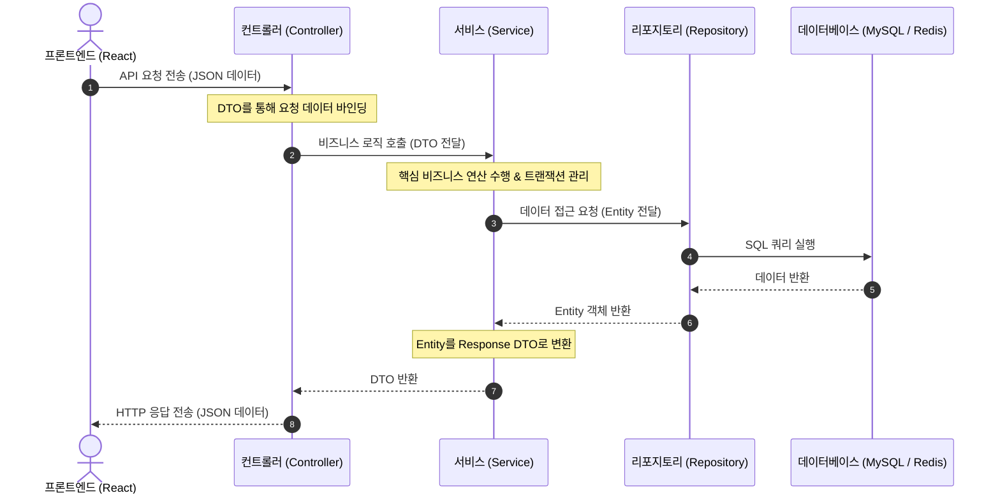

# [ZariYo 개발 & 학습 노트] 2026-07-13 (오늘)

## 1. 오늘의 작업 내용
* **백엔드 도메인 엔티티 고도화**:
  * [Store.java](file:///home/jaehyeon/바탕화면/portfolio/ZariYo/ZariYo-BackEnd/src/main/java/com/zariyo/domain/store/entity/Store.java)에 프론트엔드 연동을 위한 운영 시간 및 휴무 시간 관련 필드를 추가했습니다.
  * 2D 배치도 저장을 위한 [Seat.java](file:///home/jaehyeon/바탕화면/portfolio/ZariYo/ZariYo-BackEnd/src/main/java/com/zariyo/domain/seat/entity/Seat.java) 엔티티를 작성하고 좌석 구분을 위한 `SeatType` Enum을 설계했습니다.
  * 최종 예약의 영속성 보존을 위해 [Reservation.java](file:///home/jaehyeon/바탕화면/portfolio/ZariYo/ZariYo-BackEnd/src/main/java/com/zariyo/domain/reservation/entity/Reservation.java) 엔티티 및 상태 제어 `ReservationStatus` Enum을 추가했습니다.
* **JPA 리포지토리 레이어 추가**: `UserRepository`, `StoreRepository`, `SeatRepository`, `ReservationRepository` 인터페이스를 작성했습니다.
* **REST API 설계 및 구현 (Controller, Service, DTO)**:
  * **회원 인증 API**: 로그인 및 가입 검증 API를 구축했습니다.
  * **매장 빌더 API**: 사장님이 설정한 매장 정보 및 2D 배치 레이아웃 정보 일괄 저장 및 조회 API를 완성했습니다.
  * **실시간 좌석 예약 API**: 전체 좌석 실시간 상태 조회(`available`/`held`/`reserved`), **Redisson 분산 락**을 활용한 5분 임시 선점(`reserve`), 예약 최종 확정(`confirm`), 좌석 반납(`return`) API를 구현했습니다.
* **Swagger OpenAPI 명세 및 DTO 예제 데이터 고도화**:
  * `UserDto`, `StoreDto`, `SeatReservationDto` 내 각 필드에 `@Schema`를 부착해 의미와 모의 데이터(`example`)를 추가했습니다.
  * 컨트롤러 API 엔드포인트에 `@ApiResponse` 및 `@ApiResponses`를 연동하여 HTTP 응답 규격과 오류 처리 과정을 문서화했습니다.

---

## 2. 공부해야 할 핵심 개념 & 로직

### 💡 Spring Boot REST API의 4레이어 아키텍처 흐름과 DTO의 중요성
서버 애플리케이션은 계층적으로 역할을 쪼개어 독립된 컴포넌트로 관리하는 **4레이어 아키텍처**를 표준으로 사용합니다.



1. **Controller (문지기)**: `@RestController`를 사용해 웹 요청을 최초로 수신합니다. 프론트엔드가 보낸 JSON 문자열 데이터를 자바 객체인 **DTO**로 파싱하여 받아들입니다.
2. **Service (두뇌)**: 비즈니스 로직의 코어가 처리되는 곳입니다. 회원 자격 검증, 예약 충돌 검사, 락 제어 등을 수행합니다. `@Transactional` 어노테이션이 작동하여, 도중 에러 발생 시 모든 DB 이력을 일괄 롤백(Rollback)해 줍니다.
3. **Repository (수행 비서)**: 데이터베이스와 직접 SQL 통신을 주고받는 JPA 레이어입니다.
4. **DTO (Data Transfer Object)를 사용해야 하는 이유**:
   - 데이터베이스의 원본 데이터 형태인 `Entity`를 프론트엔드 화면에 그대로 노출하면, 테이블 구조가 유출되어 보안상 매우 취약해집니다.
   - 프론트엔드가 요구하는 데이터 모양과 DB 테이블 스키마가 서로 다를 때, DTO라는 전용 택배 상자를 활용하면 구조를 깔끔하게 다듬어서 통신할 수 있습니다.

### 💡 동시성 문제(Race Condition)와 자바 synchronized의 한계
동일한 좌석에 두 명의 유저가 거의 동시에 클릭을 눌러 선점하려고 할 때, 비즈니스 로직이 진행되는 도중(예약 여부 검사 -> 선점 처리) 스레드가 엇갈리면 **한 좌석에 두 개의 예약이 모두 통과되는 데이터 부정합**이 발생합니다.
* **자바 `synchronized`**: 하나의 Java 프로세스 내의 멀티스레드 정렬은 가능하나, 실제 상용 배포 환경과 같이 웹 서버(WAS)가 여러 대 실행되는 **분산 클러스터 환경**에서는 다른 서버로 유입되는 타 유저의 동시 요청을 막아주지 못합니다.
* **해결책**: 모든 서버가 공통으로 참조할 수 있는 외장 데이터 저장소인 **Redis**를 기준으로 락(Lock)을 걸어 여러 서버로의 유입을 공통 제어하는 **분산 락(Distributed Lock)**이 요구됩니다.

### 💡 Redisson 분산 락 (`tryLock`) 동작 매커니즘
스프링 진영에서 널리 쓰이는 Redisson 분산 락 클라이언트는 Redis의 Pub/Sub 기능을 사용해 대기 중인 스레드에 알림을 주는 효율적인 방식으로 락을 얻습니다.

```java
RLock lock = redissonClient.getLock("lock:seat:" + seatId);
boolean acquired = lock.tryLock(5, 10, TimeUnit.SECONDS);
```
* **`waitTime` (5초)**: 락을 선점한 사용자가 있을 때, 최대 5초간 대기하며 락이 반납되기를 기다립니다. 5초가 지나도록 풀리지 않으면 포기하고 실패 처리합니다.
* **`leaseTime` (10초)**: 락을 획득하고 나서 비즈니스 로직을 돌리던 중, 서버에 전원이 나가거나 에러가 나더라도 **10초가 지나면 Redis가 알아서 락을 릴리즈**하여 전체 시스템이 정지하는 데드락(Deadlock) 현상을 완전히 예방합니다.

### 💡 5분 임시 선점 시스템 동작 시나리오 (Redis TTL + RDB)
1. **락 획득**: 유저 A가 Redisson 분산 락 획득 후 임계 영역 진입.
2. **상태 검사**: Redis에 해당 좌석의 임시 선점 키(`seat:temp_occupied:{seatId}`)가 없고 DB에도 예약이 완료된 상태가 아님을 검사.
3. **임시 선점 등록**: Redis에 좌석 키의 값으로 `userId`를 세팅하고, **TTL 300초(5분)**를 설정하여 저장.
4. **락 해제**: 락 반납 후 유저 A는 안전하게 결제 단계로 진입. (이후 유저 B가 요청하면 검사 단에서 Redis 임시 키의 존재를 보고 선점 실패 처리됨)
5. **최종 확정 (`confirm`)**: 유저 A가 5분 이내 결제를 완료하면 RDB(`Reservation`)에 최종 예약을 저장하고, Redis 임시 선점 키를 즉시 삭제(`delete`)해 선점 기간을 해제합니다.
6. **자동 롤백 (만료)**: 유저 A가 결제를 진행하지 않거나 페이지를 닫으면, **5분이 지나는 순간 Redis가 자동으로 키를 소멸**시킵니다. 따라서 다른 유저가 조회했을 때 다시 해당 좌석은 자연스럽게 공석(`available`) 상태로 원상 복구됩니다.

---

## 3. 핵심 트러블슈팅
* **Gradle Wrapper(gradlew) 미보유로 인한 컴파일 127 에러**: 백엔드 디렉토리 구조 생성 시 래퍼 스크립트가 주입되지 않아 터미널 단독 빌드가 막힌 예외 상황을 기록했습니다. 로컬 자바는 17 버전이 갖춰져 있으므로 VS Code나 IntelliJ 등의 개발 도구(IDE)를 연동할 시 자동으로 의존성 분석과 빌드가 수행됨을 파악하여 해결책을 도출했습니다.
* **임시 빌드 데몬 경로 꼬임 및 NoSuchFileException**: Gradle 래퍼 생성 후 임시로 쓰인 바이너리 설치 폴더를 제거하자 백그라운드의 기존 Gradle 데몬이 예외를 뱉던 문제를 `./gradlew --stop`을 구동하여 완전히 리셋 조치했습니다.
* **백엔드 미기동으로 인한 ERR_CONNECTION_REFUSED**: DB 도커 및 프론트엔드는 켰으나 스프링 부트 서버 가동을 잊어 포트 8080 연결이 거부되었던 현상을 `./gradlew bootRun` 실행으로 해결했습니다.

---

## 4. 추가 Q&A 및 개념 정리 (2026-07-13)

### 💡 API와 비즈니스 로직(Logic)의 개념적 차이
* **API (Application Programming Interface)**:
  - 시스템끼리 데이터를 주고받을 수 있게 열어둔 **"주문 규격 창구"**입니다. (예: 메뉴판과 접수 카운터)
* **비즈니스 로직 (Business Logic)**:
  - 접수된 데이터를 토대로 실제 데이터베이스 유효성 확인, 권한 비교, 핵심 계산을 거치는 **"주방 조리 레시피"**입니다.

### 💡 Swagger UI의 cURL 영역 vs Responses 영역 구분
* Swagger UI에서 `Execute` 버튼을 누르면 가장 먼저 렌더링되는 `curl -X 'POST' ...` 상자는 단순히 터미널 CLI 구동용 스니펫을 표기하는 **cURL 영역**입니다.
* 실제 백엔드 서버가 연산한 반환 데이터(성공 여부, 남은 초 등)는 cURL 영역에서 **마우스 스크롤을 살짝 더 내려야 노출되는 `Responses` -> `Response body`** 블록에서 식별 가능합니다.

### 💡 데이터베이스 외래키(Foreign Key) 제약조건에 따른 실습 흐름 통제
* DB에 없는 임의의 ID를 바로 쏘게 되면 DB 무결성이 깨져 서버에서 거부(500 에러)하므로, **반드시 "회원가입 ➔ 매장등록 ➔ 실시간 좌석조회 ➔ 임시선점 ➔ 최종확정"의 5단계 정방향 시나리오대로 실습해야만 정상적인 결과가 데이터베이스에 반영**됩니다.

---

## 5. 실전 API 테스트 예제 데이터 세트

Swagger UI의 `Try it out` 창에 복사해서 즉시 테스트에 활용할 수 있는 JSON 요청(Request) 및 예상 응답(Response) 견본 데이터 세트입니다.

### ① 회원 가입 API (`POST /api/v1/auth/signup`)

#### 사장님 회원 가입
* **요청 (Request Body)**:
  ```json
  {
    "email": "owner@zariyo.com",
    "name": "김사장",
    "role": "ROLE_OWNER"
  }
  ```
* **성공 응답 (Response Body - 200 OK)**:
  ```json
  {
    "id": 1,
    "email": "owner@zariyo.com",
    "name": "김사장",
    "role": "ROLE_OWNER"
  }
  ```

#### 손님 회원 가입
* **요청 (Request Body)**:
  ```json
  {
    "email": "customer@zariyo.com",
    "name": "이손님",
    "role": "ROLE_CUSTOMER"
  }
  ```
* **성공 응답 (Response Body - 200 OK)**:
  ```json
  {
    "id": 2,
    "email": "customer@zariyo.com",
    "name": "이손님",
    "role": "ROLE_CUSTOMER"
  }
  ```

---

### ② 매장 설정 및 좌석 배치도 등록 API (`POST /api/v1/stores`)
* **요청 (Request Body)**: (가입된 사장님 ID `ownerId: 1` 지정)
  ```json
  {
    "name": "자리요 강남역점",
    "address": "서울시 강남구 역삼동 825-24",
    "weekdayStart": "09:00",
    "weekdayEnd": "22:00",
    "weekendStart": "10:00",
    "weekendEnd": "21:00",
    "breakStart": "15:00",
    "breakEnd": "16:00",
    "holiday": "월요일",
    "ownerId": 1,
    "elements": [
      {
        "id": "seat-uuid-1111",
        "type": "table-2",
        "label": "1번 테이블",
        "x": 100,
        "y": 150,
        "width": 60,
        "height": 60,
        "isReservable": true,
        "isTempOccupiedEnabled": true
      },
      {
        "id": "door-uuid-9999",
        "type": "door",
        "label": "출입구",
        "x": 20,
        "y": 20,
        "width": 80,
        "height": 40,
        "isReservable": false,
        "isTempOccupiedEnabled": false
      }
    ]
  }
  ```
* **성공 응답 (Response Body - 200 OK)**:
  ```json
  {
    "id": 1,
    "name": "자리요 강남역점",
    "address": "서울시 강남구 역삼동 825-24",
    "weekdayStart": "09:00",
    "weekdayEnd": "22:00",
    "weekendStart": "10:00",
    "weekendEnd": "21:00",
    "breakStart": "15:00",
    "breakEnd": "16:00",
    "holiday": "월요일"
  }
  ```

---

### ③ 실시간 좌석 예약(5분 임시 선점) API (`POST /api/v1/seats/reserve`)
* **요청 (Request Body)**: (저장된 좌석 UUID `"seat-uuid-1111"` 및 가입된 손님 ID `userId: 2` 대입)
  ```json
  {
    "seatId": "seat-uuid-1111",
    "userId": 2
  }
  ```
* **성공 응답 (Response Body - 200 OK)**:
  ```json
  {
    "success": true,
    "message": "5분 동안 좌석이 임시 선점되었습니다.",
    "seatId": "seat-uuid-1111",
    "userId": 2,
    "timeLeft": 300,
    "expiresAt": "2026-07-13T16:15:35"
  }
  ```
* **동시 요청 실패 응답 (Response Body - 409 Conflict)**: (이미 선점 완료된 상태에서 재차 락을 요청한 경우)
  ```json
  {
    "success": false,
    "message": "이미 선점되었거나 사용 중인 좌석입니다.",
    "seatId": "seat-uuid-1111",
    "userId": null,
    "timeLeft": 0,
    "expiresAt": null
  }
  ```

---

### ④ 예약 최종 확정 API (`POST /api/v1/seats/confirm`)
* **요청 (Request Body)**: (임시 선점 중인 정보 일치 대입)
  ```json
  {
    "seatId": "seat-uuid-1111",
    "userId": 2,
    "peopleCount": 2
  }
  ```
* **성공 응답 (Response Body - 200 OK)**:
  ```json
  {
    "success": true,
    "message": "좌석 예약이 최종 확정되었습니다.",
    "reservationId": 10
  }
  ```

### 💡 [리팩토링] 전역 예외 처리(RestControllerAdvice)와 DTO 정적 팩토리 메서드(from)의 도입
* **전역 예외 처리 (`@RestControllerAdvice`)**:
  - 컨트롤러 전반에서 발생하는 예외를 인터셉트하여 규격화된 에러 JSON(`ErrorResponse`)을 반환합니다. 
  - 프론트엔드가 일관된 성공/실패 포맷(`success`, `message`, `code`)을 인식할 수 있어 통신 처리가 단순화되고 에러 상세 추적이 숨겨져 보안성이 높습니다.
* **정적 팩토리 메서드 (`from()`)**:
  - 생성자 방식(`new`) 대신 DTO 내부에서 자신을 조립하여 인스턴스를 반환하는 정적 메서드입니다.
  - Entity ➔ DTO 맵핑 책임이 DTO 내부로 캡슐화되어 서비스 레이어는 비즈니스 로직에만 전적으로 집중할 수 있고 중복 코드가 말끔히 제거되었습니다.
