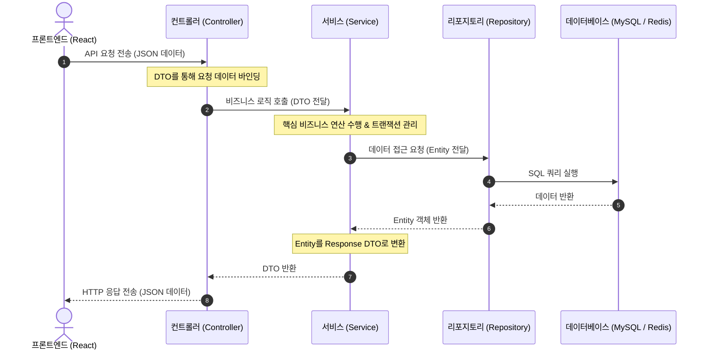
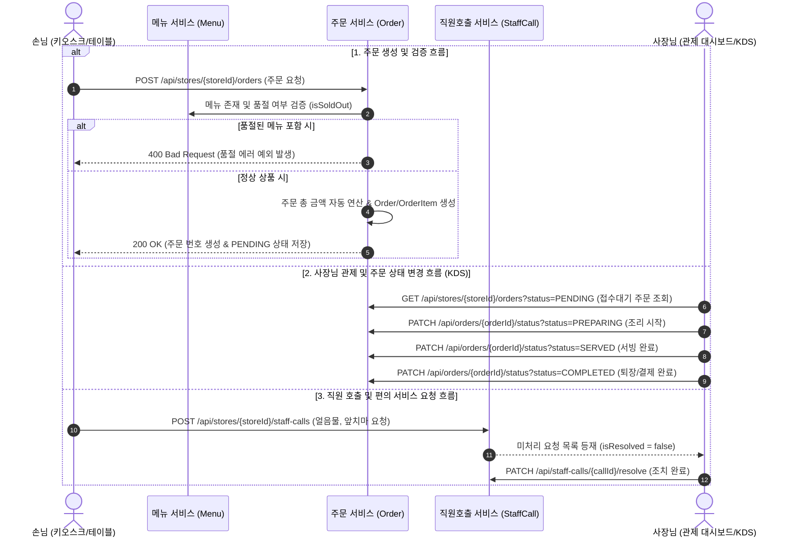

# ZariYo 백엔드 & 인프라 학습 노트 (Q&A)

이 문서는 개발 과정에서 발생한 질문과 답변, 핵심 개념들을 날짜 및 시간과 함께 기록하는 공간입니다.

---

### [2026-07-10 13:42] Q1. MySQL 설정과 데이터베이스 조작의 원리
**질문 (User)**: 
"그러면 mysql에 원래는 코드를 입력해서 db를 구성하는데 그 작업을 안해도 되는거야? 그리고 내용 저장등의 데이터베이스 작업은 어떻게 수행하는거야?"

**답변 (Antigravity)**:
과거의 전통적인 방식에서는 MySQL 터미널에 직접 접속해서 `CREATE TABLE ...` 명령어를 치고, 저장할 때도 `INSERT INTO ...` 같은 SQL 쿼리문을 직접 작성해야 했습니다. 하지만 **Spring Boot와 JPA(Java Persistence API)** 생태계에서는 이 모든 것을 자동화하는 **ORM(Object-Relational Mapping)** 방식을 사용합니다.

**1. 테이블은 어떻게 만들어지나요? (엔티티 - Entity)**
백엔드 코드를 짤 때 데이터베이스의 테이블 역할을 할 자바 클래스(Entity)를 만듭니다.
```java
@Entity // 이 클래스는 MySQL의 테이블이 될 거야! 라고 선언
public class User {
    @Id @GeneratedValue(strategy = GenerationType.IDENTITY)
    private Long id; // AUTO_INCREMENT 기본키

    @Column(nullable = false, length = 50)
    private String email; // NOT NULL, VARCHAR(50)
}
```
`application.yml`의 `ddl-auto: update` 옵션 덕분에, 서버를 실행하는 순간 Spring Boot가 이 자바 코드를 스캔해서 알아서 SQL(`CREATE TABLE user ...`)을 만들어 MySQL로 전송합니다. 즉, 테이블 생성과 관리가 100% 자동화됩니다.

**2. 내용 저장/조회는 어떻게 수행하나요? (리포지토리 - Repository)**
데이터를 다룰 때도 SQL 쿼리문을 쓰지 않습니다. 대신 `Repository` 인터페이스를 만듭니다.
```java
public interface UserRepository extends JpaRepository<User, Long> {
}
```
실제 로직에서 데이터를 저장하고 싶다면, 자바 리스트에 데이터를 넣듯 직관적으로 코딩합니다.
```java
// 데이터 저장
User newUser = new User();
newUser.setEmail("hello@zariyo.com");
userRepository.save(newUser); // JPA가 알아서 INSERT 쿼리를 생성하여 실행

// 데이터 조회
User findUser = userRepository.findById(1L).get(); // 알아서 SELECT 쿼리 실행
```

**결론**: 자바 객체(Object)만 다루면, JPA가 알아서 SQL로 번역해 MySQL과 통신하는 것이 현대 백엔드 개발(Spring Boot)의 핵심 원리입니다.

---

### [2026-07-10 13:48] Q2. Docker 컨테이너의 백그라운드 실행 (Detached Mode)
**질문 (User)**:
"그러면 도커라는 프로그램에서 가상의 컨테이너를 통해 mysql과 redis 프로그램을 설치 없이 가상화 시스템 처럼 돌리고 이를 docker-compose.yml을 통해 작동방식을 정의 하는거네 그리고 mysql을 통한 저장은 자동으로 저장 되도록 설정한거고 그러면 터미널로 계속 열어둬야해?"

**답변 (Antigravity)**:
전체적인 흐름을 정확하게 100% 이해하셨습니다! 도커가 내부적으로 가상 환경을 만들어주고, JPA가 그 안의 MySQL과 통신하며 자동 저장을 수행합니다.

가장 중요한 '터미널을 계속 열어두어야 하는가?'에 대한 답변은 **"아니요, 터미널을 닫아도 됩니다!"** 입니다.

아까 우리가 실행했던 명령어를 다시 살펴보면 뒤에 `-d` 옵션이 붙어 있었습니다.
> `docker-compose up -d`

여기서 `-d`는 **Detached(분리된) 모드**의 약자입니다. 이 옵션을 넣고 실행하면, 도커 컨테이너들이 백그라운드(보이지 않는 뒤편)에서 실행되도록 분리됩니다. 따라서 명령어를 친 **터미널 창을 완전히 꺼버려도 MySQL과 Redis는 컴퓨터가 켜져 있는 한 뒤에서 계속 정상적으로 돌아갑니다.**

* 만약 백그라운드에서 돌아가는 도커 컨테이너들을 멈추고 싶다면 새로운 터미널을 열고 `docker-compose down`을 치면 됩니다.
* 현재 잘 돌아가고 있는지 확인하고 싶다면 `docker ps` 명령어를 치면 백그라운드에서 실행 중인 컨테이너 목록이 나옵니다.

---

### [2026-07-10 13:50] Q3. JPA의 저장 원리 (SQL 없이 형변환 시스템으로 저장되는가?)
**질문 (User)**:
"그러면 자바jpa와 스프링부트 시스템을 통해서 sql구문 없이 형변환 시스템으로 저장이 가능한거야? 이부분 과정 이나 로직 좀 더 설명해줘"

**답변 (Antigravity)**:
정확히 말하자면 **"SQL 구문이 아예 안 쓰이는 것은 아닙니다. 다만 개발자가 SQL을 직접 안 짜도 되도록 JPA가 자바 객체를 SQL로 '자동 번역(Mapping)'해서 쏴주는 것"**입니다. 이를 ORM(Object-Relational Mapping)이라고 합니다.

**[내부 동작 로직 3단계]**
1. **자바 객체 조작**: 개발자는 자바 세상에서 객체(Object)를 만듭니다. (`User user = new User("재현");`)
2. **JPA (Hibernate)의 개입**: `repository.save(user)`를 호출하면, Spring Boot 내부의 JPA(구현체: Hibernate)가 이 자바 객체를 가로챕니다.
3. **SQL 자동 생성 및 전송**: JPA는 "어? 자바 객체가 새로 들어왔네? 이 객체의 모양을 보니까 `user` 테이블에 넣으면 되겠군" 하고 판단한 뒤, 내부적으로 `INSERT INTO user (name) VALUES ('재현');` 이라는 **진짜 SQL 쿼리문을 자기가 직접 작성해서 MySQL로 전송**합니다.

즉, JPA는 개발자(자바)와 MySQL(SQL) 사이에서 완벽한 **동시통역사** 역할을 해주는 것입니다.

---

### [2026-07-10 13:50] Q4. 컴퓨터 재부팅 시 도커 컨테이너 재실행 여부
**질문 (User)**:
"이후에 종료했다가 다시 해당 프로젝트를 다시 개발한다고 하면 docker를 다시 활성화 해야하는건가? 프론트엔드 run 하는 거 처럼?"

**답변 (Antigravity)**:
**아니요, 프론트엔드처럼 매번 다시 켤 필요가 없습니다!**

아까 작성한 `docker-compose.yml` 파일 코드를 보면 맨 아래쪽에 이런 줄이 있었습니다.
> `restart: always`

이 옵션이 엄청난 마법을 부립니다.
1. 컴퓨터를 끄면 도커(MySQL, Redis)도 자연스럽게 같이 꺼집니다.
2. 내일 다시 **컴퓨터를 켜면, 도커 프로그램이 백그라운드에서 실행되면서 저 `always` 옵션을 보고 "아, 이 컨테이너들은 항상 켜져 있어야 하는 애들이지!" 하면서 자동으로 다시 `up` 시켜줍니다.**

따라서 재현님은 내일 컴퓨터를 켜시면 도커 쪽은 신경 끄고, 프론트엔드(`pnpm run dev`)와 나중에 만들 백엔드(Spring Boot Run)만 켜서 바로 개발을 이어가시면 됩니다. (단, 도커 서비스 자체가 부팅 시 자동 실행되도록 설정되어 있어야 합니다. 보통 Docker Desktop이나 리눅스 환경에서는 기본적으로 자동 실행됩니다.)

---

### [2026-07-10 13:51] Q5. 프로젝트 개발을 안 할 때도 도커가 항상 켜져 있는가?
**질문 (User)**:
"그러면 만약 내가 해당 프로젝트 코딩을 안 할대도 백그라운드에서 도커는 항상 켜지는거야?"

**답변 (Antigravity)**:
네, 맞습니다! `restart: always` 옵션 때문에 **컴퓨터를 켜면 코딩을 하든 안 하든 백그라운드에서 항상 켜져 있게 됩니다.**

만약 평소에 이 프로젝트를 개발하지 않을 때 컴퓨터의 메모리나 자원을 조금이라도 아끼고 싶으시다면 두 가지 방법이 있습니다.

1. **수동 종료 (권장)**: 개발이 끝나고 당분간 안 할 것 같을 때, 터미널을 열고 `ZariYo` 폴더에서 `docker-compose down`을 칩니다. 그러면 완전히 꺼지고 다음번 부팅 때도 켜지지 않습니다. 나중에 다시 개발할 때만 `docker-compose up -d`를 한 번 쳐주시면 됩니다.
2. **자동 실행 옵션 끄기**: 아예 처음부터 수동으로 켜고 싶으시다면, `docker-compose.yml` 파일에서 `restart: always` 줄을 지워버리시면 됩니다. 그러면 컴퓨터를 켤 때마다 매번 `docker-compose up -d`를 직접 쳐주셔야 합니다.

개인 PC 사양이 충분하시다면 켜두셔도 크게 무리는 없으나, 자원 관리를 원하신다면 개발 종료 시 `docker-compose down`으로 깔끔하게 꺼두는 습관을 들이는 것이 가장 좋습니다!

---

### [2026-07-10 13:57] Q6. 첫 JPA 엔티티(User) 작성 완료 및 코드 분석
**내용**:
개발자가 직접 타이핑한 `User.java` 엔티티 코드의 주요 어노테이션과 역할을 점검하고 학습했습니다.

**[주요 어노테이션 분석]**
* `@Entity`: 이 클래스가 MySQL의 테이블(`users`)과 매핑됨을 선언.
* `@Table(name = "users")`: DB 예약어 충돌을 막기 위해 테이블명을 명시적으로 지정.
* `@Id` & `@GeneratedValue(strategy = GenerationType.IDENTITY)`: 이 필드를 기본키(PK)로 지정하고, MySQL의 `AUTO_INCREMENT` 기능을 위임하여 값이 자동으로 1, 2, 3 늘어나도록 설정.
* `@Column(nullable = false, length = 50)`: `NOT NULL` 제약조건과 `VARCHAR(50)` 길이를 설정.
* `@Enumerated(EnumType.STRING)`: Enum 타입(ROLE_CUSTOMER 등)을 DB에 저장할 때, 숫자(0, 1)가 아닌 알아보기 쉬운 문자열 원문 그대로 저장하도록 강제하는 필수 옵션.

**[주의 사항 - Lombok의 @Getter]**
엔티티 작성 시 `@Getter` 어노테이션을 누락하면, 이후 서비스(Service) 계층에서 객체의 값을 꺼내올 수 없게 되므로(예: `user.getEmail()`) 반드시 포함해야 합니다. (이후 개발 과정에서 누락되었던 `@Getter`를 복구 조치 완료)

---

### [2026-07-10 14:02] Q7. JPA 객체 연관관계 매핑 (Store 엔티티의 @ManyToOne)
**내용**:
매장(`Store`) 엔티티를 작성하며 JPA의 핵심 기능 중 하나인 테이블 간의 외래키(FK) 연결을 자바 객체 참조로 매핑하는 방법을 학습했습니다.

**[연관관계 매핑 분석]**
```java
@ManyToOne(fetch = FetchType.LAZY)
@JoinColumn(name = "user_id")
private User owner;
```
1. **`@ManyToOne`**: "여러 개의 매장(Many)은 한 명의 사장님(One)이 소유할 수 있다"는 다대일 관계를 명시합니다.
2. **`@JoinColumn(name = "user_id")`**: 데이터베이스의 `stores` 테이블에 생성될 외래키(Foreign Key) 컬럼의 이름을 지정합니다. (여기서는 `user_id`)
3. **`FetchType.LAZY` (지연 로딩)**: 실무에서 **무조건** 적용해야 하는 필수 성능 최적화 옵션입니다.
   - 만약 이 옵션이 없으면(Eager Loading), 매장 이름만 알고 싶어서 `store`를 가져올 때, JPA가 사장님의 정보(User)까지 강제로 DB에서 싹 다 긁어오게 되어 심각한 쿼리 성능 저하(N+1 문제)가 발생합니다.
   - `LAZY`를 걸어두면 매장 정보만 먼저 쏙 가져오고, 나중에 코드에서 `store.getOwner().getName()`처럼 진짜로 사장님 정보가 필요해진 그 순간에만 사장님 정보를 쿼리해서 가져옵니다.

---

### [2026-07-13 13:40] Q8. Spring Boot API의 아키텍처 흐름 (Controller - Service - Repository - DB)
**질문 (User)**:
"백엔드 API를 구축할 때 패키지가 여러 개로 쪼개지고 파일이 많아지는데, 전체적인 데이터 흐름과 각 역할이 어떻게 되는지 알고 싶어."

**답변 (Antigravity)**:
Spring Boot 백엔드 개발에서는 유지보수와 역할의 분리를 위해 **계층형 아키텍처(Layered Architecture)**를 사용합니다. 프론트엔드에서 API 요청을 보낸 후 DB를 거쳐 다시 응답을 받기까지 데이터는 다음의 4가지 레이어를 순서대로 통과합니다.



#### 1. 각 레이어의 핵심 역할과 주석
* **Controller (컨트롤러)**:
  - **역할**: 외부(프론트엔드)의 요청을 받는 **문지기**입니다. 요청 주소(URL)와 HTTP Method(GET, POST 등)를 매핑하고, 들어온 JSON 데이터를 자바 객체(DTO)로 변환해 서비스에 넘겨줍니다.
  - **어노테이션**: `@RestController`, `@PostMapping`, `@GetMapping` 등
* **Service (서비스)**:
  - **역할**: 핵심 비즈니스 로직을 수행하는 **두뇌**입니다. "이미 예약된 좌석인가?", "5분이 지났는가?" 같은 논리적 흐름을 판단하고 제어합니다. 또한, `@Transactional`을 붙여 DB 작업들의 원자성(모두 성공하거나 실패 시 전체 취소)을 관리합니다.
* **Repository (리포지토리)**:
  - **역할**: 데이터베이스에 직접 접근하는 **수행 비서**입니다. JPA의 `JpaRepository` 인터페이스를 상속받으면 복잡한 SQL 작성 없이 조회, 저장, 삭제 메서드를 무료로 사용할 수 있습니다.
* **DTO (Data Transfer Object)**:
  - **역할**: 데이터가 레이어 간에 이동할 때 담기는 **택배 상자**입니다. DB 테이블 모양인 Entity를 그대로 화면에 노출하면 보안 및 구조적 문제가 생기므로, 딱 필요한 데이터만 담아 통신하기 위해 DTO를 사용합니다.

---

### [2026-07-13 13:45] Q9. Redisson 분산 락(Distributed Lock)을 이용한 동시성 제어 원리
**질문 (User)**:
"자리요의 핵심인 동시성 제어를 위해 Redisson 분산 락을 썼는데, 이게 무엇이고 어떤 원리로 여러 명의 중복 예약을 막는 거야? tryLock의 동작 방식도 궁금해."

**답변 (Antigravity)**:
동시성 제어는 **"동일한 좌석에 두 명 이상의 유저가 0.001초 차이로 동시에 클릭했을 때, 예약이 중복되는 것을 막는 기술"**입니다.

#### 1. 왜 분산 락이 필요한가?
만약 여러 대의 서버(WAS 클러스터)를 가동하는 대규모 서비스의 경우, 자바 언어 자체의 기본 동기화 기능(`synchronized`)은 개별 서버 메모리 안에서만 동작하므로 다른 서버에서 들어오는 요청을 제어하지 못합니다. 
따라서 여러 서버가 공통으로 바라보는 외부 메모리 저장소인 **Redis**를 중재자로 활용하여, **"이 좌석은 내가 먼저 찜했으니 다른 서버들은 대기하라"**고 잠금장치를 거는 것이 **분산 락(Distributed Lock)**입니다.

#### 2. Redisson 분산 락의 핵심 동작 방식 (`tryLock`)
우리가 작성한 `SeatService.java` 내의 분산 락 코드를 보며 설명하겠습니다.

```java
RLock lock = redissonClient.getLock("lock:seat:" + seatId);
acquired = lock.tryLock(5, 10, TimeUnit.SECONDS);
```

* **`"lock:seat:" + seatId`**: 좌석 고유의 ID를 기준으로 락의 이름을 지정합니다. 이렇게 하면 12번 좌석을 누른 사람과 13번 좌석을 누른 사람은 서로 대기하지 않고 각자 독립적으로 동작하므로 성능이 유지됩니다.
* **`tryLock(5, 10, TimeUnit.SECONDS)`**:
  - **대기 시간 (Wait Time - 5초)**: 락을 먼저 획득한 스레드가 있어서 실패했을 때, 포기하지 않고 최대 5초 동안 락이 풀리기를 기다리며 획득 시도를 반복합니다. (Redisson은 스핀 락 방식 대신 Redis Pub/Sub을 활용하여 대기하므로 Redis에 부하를 주지 않습니다.)
  - **임대 시간 (Lease Time - 10초)**: 락을 성공적으로 획득한 스레드가 비즈니스 로직을 수행하다가 에러가 나거나 서버가 다운되더라도, **10초가 지나면 무조건 락이 풀리도록 자동 설정**하여 전체 시스템이 락에 묶여 영원히 멈추는 **데드락(Deadlock)**을 방지합니다.

#### 3. 5분 임시 선점 (Redis TTL) 연동 시나리오
분산 락을 사용해 안전하게 임계 영역에 들어오면, Redis에 `seat:temp_occupied:{seatId}` 형태로 유저 ID를 저장하고 **TTL(Time To Live)을 300초(5분)**로 설정합니다.
1. **락 획득**: 유저 A가 락을 잡고 진입.
2. **검증**: Redis에 임시 선점 정보가 없고 DB에도 예약 확정이 없는 것을 확인.
3. **선점 등록**: Redis에 300초 만료 시간 조건으로 유저 A 정보 저장.
4. **락 해제**: 유저 A가 안전하게 락을 놓고 반환.
5. **유저 B의 접근**: 뒤늦게 들어온 유저 B는 분산 락을 잡고 들어와도, 이미 Redis에 유저 A의 선점 데이터(`held`)가 걸려있는 것을 검증 단에서 확인하고 실패하게 됨.

---

### [2026-07-13 15:35] Q10. 현업 개발자들의 API 테스트 방식과 도구
**질문 (User)**:
"실제 현업자들은 api테스트 어떤식으로해? 툴을 쓴다던지 SWAGGER를 쓴다던지 알려줘"

**답변 (Antigravity)**:
현업 백엔드 개발자들은 API의 개발 단계, 협업 상황, 테스트 자동화 여부에 따라 다양한 도구와 방식을 조합하여 사용합니다. 크게 4가지 방식으로 분류할 수 있습니다.

#### 1. Swagger / Springdoc OpenAPI (API 문서화 + 인터랙티브 테스트)
* **특징**: 백엔드 자바 코드를 스캔하여 자동으로 API 명세 웹페이지(Swagger UI)를 만들어 줍니다.
* **사용 용도**:
  - **프론트엔드 협업**: 프론트엔드 개발자에게 "이 주소로 이 형식으로 쏘시면 됩니다"라고 문서를 따로 쓸 필요 없이 Swagger 페이지 주소 하나로 소통합니다.
  - **간단한 브라우저 테스트**: 웹 화면에서 즉시 요청 파라미터를 입력하고 `Execute` 버튼을 눌러 응답 JSON을 시각적으로 확인해볼 수 있습니다.
* **현업 평**: 명세서 작성과 테스트가 동시에 해결되는 가장 대중적인 협업 필수 툴입니다.

#### 2. Postman / Insomnia (전문 API 클라이언트 툴)
* **특징**: API 요청을 수동으로 빌드하고 테스트할 수 있는 가장 대표적인 독립형 데스크톱 프로그램입니다.
* **사용 용도**:
  - **환경(Environment) 격리**: 로컬(`localhost`), 개발 서버(`dev.zariyo.com`), 실운영 서버(`zariyo.com`)용 도메인 및 헤더 설정을 변수화하여 마우스 클릭 한 번으로 테스트 대상을 스위칭합니다.
  - **체인 요청 (API Chaining)**: 로그인 API를 호출해 발급받은 JWT 토큰을 자동으로 추출하여 다음 API 요청 헤더에 알아서 넣어주는 자바스크립트 테스트 코드를 짤 수 있습니다.
  - **요청 컬렉션 저장**: API 명세를 저장해 두고 팀원들과 공유할 수 있습니다.

#### 3. JUnit + MockMvc / RestAssured (코드로 작성하는 자동화 테스트)
* **특징**: GUI 툴을 켜서 마우스로 누르는 게 아니라, 자바 테스트 코드를 짜서 백엔드 빌드 시점에 자동으로 API가 올바른 결과를 주어주는지 검증합니다.
* **사용 용도**:
  - **회귀 테스트(Regression Test)**: 소스코드를 대량으로 리팩토링하거나 변경했을 때, 기존 API 기능들이 망가지지 않았는지 1초 만에 수백 개의 API를 일제히 호출하여 통과 여부를 검증합니다.
  - **CI/CD 통합**: 깃허브에 코드를 올리면 서버가 빌드되기 전 자동으로 이 자바 테스트 코드들이 실행되어, 하나라도 실패하면 배포가 자동으로 중단되게 안전장치를 겁니다.

#### 4. VS Code REST Client (.http 파일 기반)
* **특징**: VS Code 확장 프로그램으로, 프로젝트 내부에 텍스트 파일(예: `test.http`)을 만들고 HTTP 요청 양식을 일반 텍스트로 적어두는 방식입니다.
* **사용 용도**:
  - **가볍고 빠른 테스트**: 무거운 Postman을 켜지 않고 에디터 내부에서 바로 `Send Request` 링크 버튼을 눌러 테스트 결과를 분할 화면으로 봅니다.
  - **버전 관리**: 텍스트 파일이므로 깃(Git)에 올려서 팀원들과 테스트용 요청 템플릿을 온전히 공유할 수 있습니다.

#### 💡 자리요(ZariYo) 프로젝트 추천안:
1. **코드 레벨 테스트**: 백엔드 빌드 환경의 안정성을 위해 `ZariYo-BackEnd`에 **JUnit + MockMvc**를 적용해 봅니다.
2. **문서화**: 백엔드 스프링 부트 프로젝트에 `springdoc-openapi-starter-webmvc-ui` 의존성을 추가해서 **Swagger UI**를 활성화하면 프론트엔드와 소통하거나 사용자가 직접 웹 브라우저 상에서 좌석 선점/예약 API를 클릭 테스트해 볼 수 있어 매우 편리합니다.

---

### [2026-07-13 15:40] Q11. Swagger를 이용한 백엔드 API 명세 자동화 및 실습 가이드
**질문 (User)**:
"swagger로 실습해보고 싶어 방법이랑 예제들 알려줘"

**답변 (Antigravity)**:
Spring Boot 3.x 환경에서 Swagger(OpenAPI 3)를 연동하고, 컨트롤러에 어노테이션을 활용해 문서를 고도화하는 방법과 실습 방법을 정리했습니다.

#### 1단계: 의존성(Dependency) 및 설정 추가
`build.gradle` 파일에 다음 라이브러리를 추가하고 프로젝트 의존성을 동기화(Refresh)합니다.
```groovy
// build.gradle
dependencies {
    // Swagger (OpenAPI 3) 의존성 추가
    implementation 'org.springdoc:springdoc-openapi-starter-webmvc-ui:2.5.0'
}
```

그 후, Swagger 명세서 상단에 표기될 정보를 설정하는 Configuration 클래스를 작성합니다.
```java
// com.zariyo.global.config.OpenApiConfig.java
package com.zariyo.global.config;

import io.swagger.v3.oas.models.OpenAPI;
import io.swagger.v3.oas.models.info.Info;
import org.springframework.context.annotation.Bean;
import org.springframework.context.annotation.Configuration;

@Configuration
public class OpenApiConfig {
    @Bean
    public OpenAPI openAPI() {
        return new OpenAPI()
                .info(new Info()
                        .title("자리요 (ZariYo) API 명세서")
                        .description("실시간 좌석 예약 및 5분 임시 선점 시스템 '자리요'의 백엔드 REST API 명세서입니다.")
                        .version("v1.0.0"));
    }
}
```

#### 2단계: 컨트롤러 어노테이션 적용 (명세서 데코레이팅)
API 가독성을 높이기 위해 컨트롤러 클래스와 개별 메서드(엔드포인트)에 OpenAPI 설명 어노테이션을 부착합니다.

* **`@Tag`**: 컨트롤러 클래스 상단에 부여하여 관련 API들을 하나의 카테고리로 묶어줍니다.
* **`@Operation`**: 각각의 API 핸들러 메서드 상단에 부여하여 API의 짧은 제목(`summary`)과 상세한 기능 설명(`description`)을 덧붙입니다.

**[적용 예시 (StoreController.java)]**
```java
@Tag(name = "Store API", description = "매장 설정 및 2D 캔버스 배치도 레이아웃 API")
@RestController
@RequestMapping("/api/v1/stores")
public class StoreController {

    @Operation(summary = "사장님 소유 매장 목록 조회", description = "특정 사장님(ownerId)이 등록한 매장 목록을 가져옵니다.")
    @GetMapping("/owner/{ownerId}")
    public ResponseEntity<List<StoreDto.Response>> getStoresByOwner(@PathVariable("ownerId") Long ownerId) {
        ...
    }
}
```

#### 3단계: Swagger UI를 통한 실습 및 테스트
1. **서브 구동**: 스프링 부트 백엔드 애플리케이션을 구동합니다.
2. **Swagger UI 페이지 접속**: 웹 브라우저를 열고 아래 주소로 접속합니다.
   ➔ **`http://localhost:8080/swagger-ui/index.html`**
3. **인터랙티브 실습 수행**:
   - 화면에 우리가 생성한 **Store API**, **Seat API**, **Auth API** 그룹들이 펼쳐집니다.
   - 테스트하려는 API(예: 사장님 소유 매장 목록 조회 - `GET /api/v1/stores/owner/{ownerId}`)를 클릭하여 세부 사양을 엽니다.
   - 우측의 **`Try it out`** 버튼을 클릭합니다.
   - 입력 폼이 활성화되면 경로 변수인 `ownerId` 칸에 테스트하고 싶은 값(예: `1`)을 입력합니다.
   - 하단의 파란색 **`Execute`** 버튼을 누릅니다.
   - 페이지 아래에 생성된 **`Responses`** 블록에서 서버로부터 반환받은 HTTP 상태 코드(200 OK 등)와 실제 가구 레이아웃 JSON 데이터 결과를 즉석에서 확인합니다.

---

### [2026-07-13 15:53] Q12. Swagger (OpenAPI 3) DTO @Schema 명세 및 @ApiResponse 응답 코드 고도화

**질문 (User)**:
"다시 swagger랑 api예제 구성해줘. DTO에 설명 추가하거나 응답 코드 설정하는 방법이랑 그 원리는 뭐야?"

**답변 (Antigravity)**:
기본적으로 Swagger는 자바 클래스와 컨트롤러의 메서드 시그니처만 스캔해서 빈 껍데기 문서를 만들어 줍니다. 하지만 실무에서는 프론트엔드 개발자가 API 문서만 보고도 "이 필드에는 어떤 값을 보내야 하는지", "에러가 나면 어떤 HTTP 상태 코드가 오는지" 한눈에 파악할 수 있어야 협업이 원활해집니다.

이를 위해 DTO와 컨트롤러에 **OpenAPI 상세 데코레이션 어노테이션**을 부착하여 명세를 고도화했습니다.

#### 1. DTO 필드에 예시와 설명 넣기 (`@Schema`)
자바 DTO의 멤버 변수에 `@Schema` 어노테이션을 부여하면, Swagger UI의 'Schemas' 탭이나 요청/응답 예시 바디에서 설명과 가짜 데이터를 노출해 줍니다.

```java
public static class SignupRequest {
    @Schema(description = "사용자 이메일 주소", example = "owner@zariyo.com", requiredMode = Schema.RequiredMode.REQUIRED)
    private String email;

    @Schema(description = "사용자 이름 또는 상호명", example = "홍길동", requiredMode = Schema.RequiredMode.REQUIRED)
    private String name;

    @Schema(description = "사용자 역할군 (ROLE_CUSTOMER, ROLE_OWNER)", example = "ROLE_OWNER")
    private Role role;
}
```

* **`description`**: 이 필드가 의미하는 바를 텍스트로 적어줍니다.
* **`example`**: 실제 전송될 법한 예시 값(mock data)을 적어줍니다. Swagger UI 상에서 'Try it out'을 누를 때 이 예시 데이터가 입력 폼에 자동으로 채워지므로 테스트가 매우 편리해집니다.
* **`requiredMode`**: 필수 값 여부를 규정하여 문서에 빨간색 아스테리스크(`*`) 기호로 필수 표시를 띄워줍니다.

#### 2. 발생 가능한 에러 응답 명세화 (`@ApiResponse` & `@ApiResponses`)
성공(200 OK)뿐만 아니라, 예외 상황에 대한 명세를 추가하면 프론트엔드에서 이에 대응하는 예외 처리 화면을 매핑하기가 수월해집니다.

```java
@Operation(summary = "좌석 5분 임시 선점 신청", description = "선택한 좌석을 다른 사용자가 점유할 수 없게 5분 동안 임시 선점(Redis Lock) 상태로 등록합니다.")
@ApiResponses(value = {
    @ApiResponse(responseCode = "200", description = "임시 선점 결과 반환 (성공/실패 여부는 body 내 success 필드 참고)"),
    @ApiResponse(responseCode = "400", description = "유효하지 않은 파라미터 (좌석 ID 또는 회원 ID 누락)"),
    @ApiResponse(responseCode = "409", description = "이미 다른 요청에 의해 해당 좌석이 선점/점유된 경우")
})
@PostMapping("/reserve")
public ResponseEntity<SeatReservationDto.ReserveResponse> reserveSeatTemporary(@RequestBody SeatReservationDto.ReserveRequest request) {
    ...
}
```

* **`@ApiResponses`**: 여러 개의 가능한 응답 시나리오를 묶어줍니다.
* **`@ApiResponse`**: 특정 HTTP 상태 코드(`responseCode`)와 그 상황에 대한 요약 설명(`description`)을 엮어 문서에 표로 노출합니다.

#### 💡 기대 효과 및 실습 팁
이렇게 구성하면 `http://localhost:8080/swagger-ui/index.html`에 재접속했을 때,
1. **스마트한 입력 폼**: API 요청을 보낼 때 어떤 데이터를 JSON으로 채워 넣어야 하는지 견본 스키마가 `example` 값들로 가득 찬 채 완성되어 노출됩니다.
2. **명확한 예외 정보**: 어떤 사유로 400 에러나 409 에러가 일어날 수 있는지 API 규격서에 박제되어 소통 코스트가 0에 가깝게 절감됩니다.

---

### [2026-07-13 15:58] Q13. API와 비즈니스 로직의 개념 차이 및 Swagger 실습 시나리오 가이드

**질문 (User)**:
"이제 화면은 나오는데 이걸로 어떤 걸 보고 테스트해야 하는지 모르겠어. 그리고 API가 로직이라고 생각하면 되는 걸까?"

**답변 (Antigravity)**:
API와 비즈니스 로직은 밀접하지만 서로 다른 역할을 의미합니다. 백엔드 동작을 더 쉽게 이해하실 수 있도록 개념과 실제 Swagger 테스트 시나리오를 정리해 드립니다.

---

#### 1. API와 비즈니스 로직(Logic)의 차이점
* **API (Application Programming Interface - 창구)**:
  - **정의**: 시스템과 시스템(예: 프론트엔드와 백엔드)이 데이터를 주고받기 위한 **"약속된 통로"** 또는 **"주문 창구"**입니다.
  - **비유**: 식당의 **"카운터(주문 매대)와 메뉴판"**입니다. 손님이 메뉴판을 보고 "1번 테이블 주문이요" 하고 외치면, 카운터 직원이 주문을 받아서 주방으로 넘깁니다. API는 이 주문 접수 역할을 수행합니다.
* **비즈니스 로직 (Business Logic - 요리 과정)**:
  - **정의**: 프로그램이 실제로 비즈니스 목적을 달성하기 위해 돌아가는 **"알고리즘, 연산, 정책, 검증 규칙"**의 흐름입니다.
  - **비유**: 식당 주방에 있는 요리사의 **"조리 레시피와 요리 과정"**입니다. 주문이 들어왔을 때 "이 재료가 주방에 남아 있는가?(재고 검증)", "주문한 유저가 돈이 충분한가?(결제 검증)", "실제 음식을 구워낸다(데이터 처리)"와 같은 실제 백엔드의 내부 계산 작업이 로직입니다.
* **결론**: **"API(주문 창구)로 데이터를 집어넣으면, 그 안에서 비즈니스 로직(레시피)이 가동되어 데이터를 연산하고, 결과물을 다시 API 창구로 돌려준다"**고 이해하시면 완벽합니다!

---

#### 2. Swagger UI를 통한 자리요(ZariYo) 시나리오 테스트 가이드
Swagger UI 화면을 보면서 아래 5단계를 차례대로 누르며 테스트해보면, 프론트엔드와 백엔드가 내부적으로 어떻게 데이터를 교환하고 로직이 맞물리는지 명확하게 체험할 수 있습니다.

##### 1단계: 사장님과 손님 가입하기 (`Auth API` 그룹)
데이터베이스에 회원 데이터가 존재해야 매장을 등록하고 예약을 진행할 수 있습니다.
1. **`POST /api/v1/auth/signup`** (회원가입) 클릭 -> `Try it out` 클릭.
2. Request Body의 내용을 아래 사장님 데이터로 수정 후 `Execute` 실행:
   ```json
   {
     "email": "owner@zariyo.com",
     "name": "김사장",
     "role": "ROLE_OWNER"
   }
   ```
3. 성공 시 하단 Response에 사장님의 고유 ID(예: `id: 1`)가 발급되는지 확인합니다.
4. 똑같은 방식으로 손님(Customer) 회원가입도 진행합니다:
   ```json
   {
     "email": "customer@zariyo.com",
     "name": "이손님",
     "role": "ROLE_CUSTOMER"
   }
   ```
5. 손님의 고유 ID(예: `id: 2`)도 발급받아 기억합니다.

##### 2단계: 사장님의 매장 정보와 좌석 배치도 등록하기 (`Store API` 그룹)
가입한 사장님 ID(예: `1`)를 소유자로 매장을 등록하면서 2D 좌석 레이아웃을 일괄 저장합니다.
1. **`POST /api/v1/stores`** (매장 및 좌석 배치도 저장) 클릭 -> `Try it out` 클릭.
2. 아래 데이터를 참고하여 입력 폼을 채우고 실행합니다 (이때 `ownerId`에 방금 가입시킨 사장님 ID인 `1`을 대입합니다):
   ```json
   {
     "name": "자리요 강남역점",
     "address": "서울시 강남구 역삼동",
     "weekdayStart": "09:00",
     "weekdayEnd": "22:00",
     "ownerId": 1,
     "elements": [
       {
         "id": "seat-uuid-1111",
         "type": "table-2",
         "label": "1번 테이블",
         "x": 100,
         "y": 150,
         "width": 60,
         "height": 60,
         "isReservable": true,
         "isTempOccupiedEnabled": true
       }
     ]
   }
   ```
3. 성공 시 생성된 매장의 고유 ID(예: `id: 1`)가 응답으로 출력됩니다.

##### 3단계: 매장의 실시간 좌석 상태 조회하기 (`Seat API` 그룹)
방금 생성된 매장의 실시간 좌석들이 어떤 상태인지 조회해 봅니다.
1. **`GET /api/v1/seats`** (실시간 좌석 상태 목록 조회) 클릭 -> `Try it out` 클릭.
2. `storeId` 변수 칸에 매장 ID인 `1`을 입력하고 `Execute` 실행.
3. Response body에 아까 등록한 `"1번 테이블"`의 상태가 `"available"` (공석)으로 뜨고, `status` 정보가 정상적으로 노출되는지 확인합니다.

##### 4단계: 좌석 5분 임시 선점 신청하기 (`Seat API` 그룹)
손님 ID(예: `2`)를 사용해 `seat-uuid-1111` 좌석에 대해 5분 동안 잠금을 걸어 찜해 봅니다. (Redisson 분산 락 + Redis TTL 작동)
1. **`POST /api/v1/seats/reserve`** (좌석 5분 임시 선점 신청) 클릭 -> `Try it out` 클릭.
2. Body를 채우고 실행:
   ```json
   {
     "seatId": "seat-uuid-1111",
     "userId": 2
   }
   ```
3. 응답에 `"success": true`, `"timeLeft": 300` (남은 초), `"message": "5분 동안 좌석이 임시 선점되었습니다."` 가 출력되는지 확인합니다.
4. **[동시성 테스트]** 이 상태에서 `Execute` 버튼을 한 번 더 누르면, 이미 선점된 좌석이므로 `"success": false`와 함께 이미 선점되어 예약이 불가하다는 오류 메시지가 정상적으로 수신되는지 확인합니다.

##### 5단계: 결제 후 예약 최종 확정하기 (`Seat API` 그룹)
5분 임시 선점 시간 내에 결제 수단 입력을 마쳤다고 가정하고 최종 예약을 DB(MySQL)에 등록합니다.
1. **`POST /api/v1/seats/confirm`** (예약 최종 확정) 클릭 -> `Try it out` 클릭.
2. Body를 채우고 실행:
   ```json
   {
     "seatId": "seat-uuid-1111",
     "userId": 2,
     "peopleCount": 2
   }
   ```
3. 성공 시 DB에 최종 영속 예약이 생성되어 발급된 고유 예약 일련번호(`reservationId`)가 반환되는지 확인합니다.
4. 이후 다시 **`GET /api/v1/seats`**를 호출하여 해당 좌석 상태를 조회하면 `"status": "reserved"`로 상태가 실시간 갱신되어 있음을 확인하실 수 있습니다!

---

### [2026-07-13 16:07] Q14. Swagger UI 결과(Response) 확인 위치 및 DB 외래키(Foreign Key) 제약 조건

**질문 (User)**:
"Execute를 누르면 결과에 네가 말한 내용(success: true 등)은 없고 curl -X 'POST' ... 이런 텍스트만 보이는데, 내 컴퓨터 터미널에서 따로 결과 값을 확인해야 하는 거야?"

**답변 (Antigravity)**:
아닙니다! 브라우저 터미널이나 컴퓨터 명령창을 따로 확인하실 필요가 전혀 없습니다. Swagger UI 내부에서 실시간 결과 값을 확인하실 수 있습니다. 이 현상이 발생하는 이유는 **Swagger UI의 화면 구성 특성**과 **데이터베이스의 외래키 제약조건** 때문입니다.

#### 1. Swagger UI 결과 창 확인하는 법 (조금 더 아래로 스크롤!)
Swagger UI에서 `Execute` 버튼을 누르면 그 아래에 결과가 나타나는데, 영역이 두 가지로 쪼개져 있습니다.

* **`cURL` 영역 (유저분이 보신 영역)**:
  - "이 요청을 만약 검은색 터미널에서 리눅스 명령어로 쏜다면 이렇게 입력하시면 됩니다" 하고 템플릿 명령어 스니펫(`curl -X 'POST' ...`)을 보여주는 친절 보조용 영역입니다.
* **`Responses` 영역 (진짜 결과값이 나오는 영역)**:
  - **cURL 영역에서 마우스 스크롤을 살짝만 아래로 더 내리면** `Server response`와 함께 **`Response body`**라는 하얗거나 검은 텍스트 상자가 나옵니다.
  - 바로 그 `Response body` 안에 서버가 보낸 진짜 결과 JSON 데이터(`{"success": true, ...}`)가 들어 있습니다.

#### 2. 순서대로 하지 않았을 때 일어나는 에러 (DB 외래키 제약조건)
만약 `Response body` 영역을 찾았는데, 성공 메시지 대신 `500 Internal Server Error`나 붉은색 에러 텍스트가 적혀 있다면 **데이터의 선후 관계 규칙**이 깨졌기 때문입니다.

* **원인**: 좌석 예약(`Seat`)과 매장(`Store`), 회원(`User`)은 데이터베이스 상에서 **외래키(Foreign Key)**라는 강력한 실선으로 묶여 있습니다.
* **로직**: 존재하지 않는 손님 ID(`userId: 2`)나 존재하지 않는 좌석 ID(`seatId: "seat-uuid-1111"`)로 곧바로 4단계(임시 선점)를 실행하면, DB 엔진이 "어? 우리 회원 목록에는 2번 유저도 없고 좌석 목록에는 그런 UUID도 없는데 어떻게 억지로 락을 걸고 예약을 만드냐!" 하고 데이터 무결성 예외를 띄우며 요청을 거부합니다.
* **해결법**: 반드시 **1단계(회원가입) ➔ 2단계(매장등록 및 좌석 배치도 저장) ➔ 3단계(좌석 조회) ➔ 4단계(임시 선점)** 순서대로 차례차례 API를 쏘면서 DB에 실제 1번 사장님, 2번 손님, 그리고 좌석 UUID 데이터들을 한 단계씩 쌓아주셔야 정상 성공 응답을 얻을 수 있습니다.

---

### [2026-07-13 16:15] Q16. 전역 예외 처리(RestControllerAdvice)와 정적 팩토리 메서드(Static Factory Method)의 이점

**질문 (User)**:
"백엔드 코드를 리팩토링하면서 전역 예외 처리기랑 from 같은 정적 메서드들을 적용했는데, 이 개념들이 자바/스프링에서 왜 중요하고 어떤 점이 좋은지 설명해줘."

**답변 (Antigravity)**:
소프트웨어가 커지면 단순히 기능이 동작하는 것뿐만 아니라 **"코드가 얼마나 읽기 편한지(가독성)"**와 **"에러 상황에 얼마나 우아하게 대처하는지(견고함)"**가 중요한 유지보수 척도가 됩니다. 이번 리팩토링에서 도입한 두 가지 핵심 개념의 원리와 효과는 다음과 같습니다.

---

#### 1. 전역 예외 처리기 (`@RestControllerAdvice`)
이전 코드에서는 예외가 발생하면 자바 표준 예외(`IllegalArgumentException`)가 그대로 던져져 브라우저에 불친절한 500 에러 스택 정보가 그대로 반환되었습니다. 

* **동작 원리**: 
  - 스프링 부트 애플리케이션의 모든 컨트롤러에서 던지는 예외를 공중에서 가로채는 **"중앙 예외 관제탑"**을 세우는 것입니다.
  - `@RestControllerAdvice` 클래스가 모든 API 요청 길목을 지키고 있다가, 예외가 감지되면 즉시 가로채어 규격화된 에러 객체인 `ErrorResponse` JSON 데이터로 변환해 리턴합니다.
* **이점**:
  - **프론트엔드 연동 편리성**: 성공 시에는 `{"success": true, ...}`, 에러 시에는 `{"success": false, "message": "에러내용"}`으로 언제나 **일관된 응답 뼈대**가 보장되므로 프론트엔드가 수월하게 예외 팝업창을 띄울 수 있습니다.
  - **보안성 향상**: 서버 코드의 줄 번호나 클래스 명칭이 고스란히 담긴 에러 스택 트레이스(Error Stack Trace)가 외부 유저에게 노출되는 보안 취약점을 완전히 은닉합니다.
  - **컨트롤러 슬림화**: 개별 컨트롤러 메서드마다 `try-catch` 블록을 주렁주렁 달 필요가 없어져 코드가 매우 간결해집니다.

---

#### 2. DTO 정적 팩토리 메서드 패턴 (`from` 메서드)
기존에는 서비스 계층에서 DB 엔티티 데이터를 조회한 뒤 아래와 같이 직접 DTO 생성자를 호출했습니다.
`new UserDto.Response(user.getId(), user.getEmail(), user.getName(), user.getRole().name())`

* **동작 원리**:
  - 생성자(`new`)를 직접 호출해 인스턴스를 만드는 방식 대신, 클래스 내부에 **자신을 직접 생성해서 반환해주는 `static` 메서드**를 심어두는 객체지향 디자인 기법입니다.
  - DTO 내부에 `public static Response from(User user)`를 만들어 데이터 변환 로직을 캡슐화합니다.
* **이점**:
  - **관심사의 분리 (Separation of Concerns)**: "엔티티의 어떤 컬럼을 DTO의 어떤 필드에 맵핑할 것인가" 하는 조립 규칙은 DTO 스스로가 알고 있는 것이 맞습니다. 서비스 레이어는 비즈니스 흐름 제어에만 신경 쓰도록 책임을 명확히 합니다.
  - **코드 다이어트**: 서비스 단의 소스코드 줄 수가 비약적으로 줄어듭니다. `return UserDto.Response.from(user);` 한 줄로 매핑 작업이 단축됩니다.
  - **이름을 가질 수 있는 생성 방식**: 생성자는 무조건 클래스 이름으로만 호출해야 하지만, 정적 메서드는 `from()`, `of()`, `createWithDefault()` 등 이름을 다양하게 지어 생성 목적과 문맥을 코드로 명확히 표현할 수 있습니다.

---

### [2026-07-27 12:28] Q17. 키오스크 & 관제 연동을 위한 백엔드 3대 코어 도메인(menu, order, staffcall) 구축 활동 및 데이터 흐름
**질문 (User)**:
"방금 백엔드 무슨 활동 한건지 알려줘"

**답변 (Antigravity)**:
방금 진행한 백엔드 작업은 프론트엔드의 **손님 키오스크/테이블 오더** 및 **사장님 실시간 대시보드/KDS(주방 주문 표시 시스템)**와 실시간으로 연동되는 **핵심 비즈니스 3대 백엔드 도메인(`menu`, `order`, `staffcall`)을 새로 설계하고 구현한 작업**입니다.

각 도메인별 역할과 데이터 처리 구조는 다음과 같습니다:

#### 1. 메뉴 도메인 (`com.zariyo.domain.menu`)
* **역할**: 매장의 메뉴 카테고리(메인 요리, 사이드, 음료 등), 메뉴 항목, 추가 옵션(치즈 추가, 곱빼기 등)을 관리하고 품절(Sold Out) 처리 기능을 제공합니다.
* **핵심 클래스**:
  - `Category` (엔티티): 매장별 카테고리 분류 및 표시 순서(`displayOrder`) 관리
  - `MenuItem` (엔티티): 메뉴명, 단가, 설명, 이미지 URL, 배지(BEST, NEW 등), 인기 여부, 품절 여부
  - `MenuOption` (엔티티): 메뉴별 커스텀 옵션명과 추가 금액
  - `MenuController`: `/api/stores/{storeId}/categories`, `/api/menus`, `/api/menus/{menuId}/sold-out`
* **주요 흐름**: 키오스크나 매장 도면에서 메뉴 목록을 불러오거나, 사장님이 원클릭으로 특정 메뉴를 품절 처리할 수 있습니다.

#### 2. 주문 도메인 (`com.zariyo.domain.order`)
* **역할**: 손님이 키오스크/테이블 오더에서 주문한 내역을 데이터베이스에 영속 저장하고, 주방(KDS) 및 사장님 관제판에서 주문 상태를 단계별로 변경할 수 있도록 지원합니다.
* **핵심 클래스**:
  - `Order` (엔티티): 주문번호(`ORD-20260727-XXXX`), 테이블 번호, 총 결제 금액, 주문 시각
  - `OrderItem` (엔티티): 주문에 포함된 메뉴 항목, 수량, 단가, 선택 옵션 요약
  - `OrderStatus` (Enum): `PENDING`(접수대기) ➔ `PREPARING`(조리중) ➔ `SERVED`(서빙완료) ➔ `COMPLETED`(퇴장/결제완료) / `CANCELLED`
  - `OrderType` (Enum): `EAT_IN`(매장 식사), `TAKE_OUT`(포장)
  - `OrderController`: `/api/stores/{storeId}/orders` (신규 주문 접수 & 최신순 목록 조회), `/api/orders/{orderId}/status` (상태 변경)
* **주요 흐름**: 손님이 키오스크에서 장바구니 결제 시 주문이 접수되며, 사장님 대시보드에서 조리 시작/서빙 완료 버튼을 누르면 상태가 즉시 갱신됩니다.

#### 3. 직원 호출 도메인 (`com.zariyo.domain.staffcall`)
* **역할**: 손님이 테이블 오더 화면에서 요청한 편의 서비스(시원한 얼음물, 일회용 앞치마, 수저/집기 추가 등) 또는 직원 호출 데이터를 접수하고 관제판에서 조치 완료 처리를 지원합니다.
* **핵심 클래스**:
  - `StaffCall` (엔티티): 테이블 번호, 요청 항목 문자열, 처리 완료 여부(`isResolved`), 요청 시각 및 처리 시각
  - `StaffCallController`: `/api/stores/{storeId}/staff-calls` (호출 등록 & 미처리 호출 목록 조회), `/api/staff-calls/{callId}/resolve` (조치 완료)
* **주요 흐름**: 손님이 모달에서 편의 요청 선택 시 관제판에 실시간으로 요청 카드 항목이 뜨며, 직원이 전달 후 조치 완료 버튼을 눌러 처리합니다.

#### 4. 검증 및 문서화
- 전체 API에 **Swagger (OpenAPI 3)** 명세를 통합하여 `http://localhost:8080/swagger-ui/index.html`에서 즉시 실행 및 테스트가 가능합니다.
- Gradle 빌드 명령(`./gradlew build -x test`)을 실행하여 자바 컴파일 및 의존성 주입에 오류가 없음을 **`BUILD SUCCESSFUL`**로 확인했습니다.

---

### [2026-07-27 12:30] Q18. 자리요(ZariYo) 백엔드 메뉴·주문·직원호출 전체 비즈니스 로직 및 처리 흐름
**질문 (User)**:
"지금 그러면 로직이 어떻게 되어있는거야"

**답변 (Antigravity)**:
현재 구현된 백엔드 로직은 **1) 손님의 주문 접수 및 검증**, **2) 사장님의 주문 상태 관제(KDS)**, **3) 테이블 직원 호출 처리**, **4) 매장 메뉴 및 품절 제어**로 나누어 유기적으로 연동되어 작동합니다.

#### 1. 전체 비즈니스 시퀀스 흐름도


#### 2. 각 로직의 세부 검증 규칙 및 처리 방식
1. **주문 검증 및 총액 연산 로직 (`OrderService.createOrder`)**:
   - 프론트엔드가 보낸 `menuItemId` 리스트를 하나씩 순회하며 DB에서 실제 메뉴 정보를 찾습니다.
   - 만약 특정 메뉴가 사장님에 의해 **품절(`isSoldOut = true`)** 처리되어 있다면 예외(`IllegalStateException`)를 발생시켜 주문을 원천 차단합니다.
   - 단가와 수량을 곱해 서버에서 **총 결제 금액(`totalAmount`)을 재계산**하여 클라이언트 단의 데이터 위변조를 막습니다.
   - 주문 번호는 `ORD-날짜(YYYYMMDD)-UUID 4자리` 조합으로 고유하게 발행됩니다.

2. **주문 상태 수명 주기 (Order Life Cycle)**:
   - `PENDING`: 키오스크에서 방금 접수된 상태
   - `PREPARING`: 주방(KDS)에서 조리를 시작한 상태
   - `SERVED`: 서빙이 완료된 상태
   - `COMPLETED`: 고객 식사 후 퇴장 및 결제 완료 처리된 상태
   - `CANCELLED`: 주문 취소 처리된 상태

3. **직원 호출 릴레이 로직 (`StaffCallService`)**:
   - 손님이 선택한 복수 편의 요청(예: `["시원한 얼음물", "일회용 앞치마"]`)을 콤마 구분 문자열로 변환하여 DB에 적재합니다.
   - 사장님 대시보드는 미처리 상태(`isResolved = false`)의 카드만 필터링하여 보여주며, 직원이 해당 손님에게 전달 후 처리 완료 클릭 시 `isResolved = true`로 변경되고 소거됩니다.

---

### [2026-07-27 12:45] Q19. 웹소켓(WebSocket) 구동 시 별도 하드웨어 구축 필요 여부 및 통신 프로토콜의 원리
**질문 (User)**:
"근데 웹소켓은 따로 하드웨어가 갖춰져야 하는거 아닌가? ㄱ냥 통신으로서의 연결 역할을 하는건가"

**답변 (Antigravity)**:
**"아니요! 웹소켓은 별도의 전용 장비나 하드웨어가 전혀 필요하지 않습니다."**

웹소켓은 특수한 기계가 아니라 **소프트웨어 통신 규약(Protocol)**입니다. 기존의 일반 랜선, Wi-Fi, 인터넷 망 환경 그대로에서 **"소프트웨어 코드만으로 구축하는 양방향 통신 방식"**입니다.

#### 1. 일반 HTTP 통신 vs 웹소켓(WebSocket) 통신 비교
* **일반 HTTP 통신 (단방향 - 요청/응답 방식)**:
  - **특징**: 손님이 "저 메뉴판 좀 주세요" 하고 먼저 요청(Request)을 보내야만 서버가 응답(Response)을 주는 구조입니다.
  - **한계**: 손님이 화면에서 아무 조치도 하지 않으면, 서버에 새 주문이 들어왔거나 좌석이 차도 사장님 화면에 "새 주문 왔습니다!" 하고 알려줄 수가 없습니다.
* **웹소켓(WebSocket) 통신 (양방향 실시간 전이중 통신 - Full-Duplex)**:
  - **특징**: 웹 브라우저와 백엔드 서버 사이에 **"빨대(전용 데이터 통로)"**를 하나 꽂아둔 채 계속 뚫어놓는(Handshake) 방식입니다.
  - **장점**: 한번 연결이 수립되면 사장님이 화면을 클릭하지 않아도, 손님이 키오스크에서 주문하는 **그 0.001초 순간에 서버가 사장님 화면으로 메시지를 즉시 밀어넣어(Push)** 줍니다.

#### 2. STOMP / SockJS의 역할
* **웹소켓**: 데이터를 주고받을 수 있는 **"투명한 고속 도로(연결 통로)"**
* **STOMP (Simple Text Oriented Messaging Protocol)**: 고속 도로 위에서 "이 메시지는 1번 매장의 주문 데이터다(`/topic/stores/1/orders`)" 처럼 주소표(우편함)를 붙여서 딱 필요한 사람에게만 배달해 주는 **소프트웨어 우체부 규칙**
* **SockJS**: 구형 브라우저나 일부 보안 네트워크에서 웹소켓이 차단될 경우, 다른 대체 방식(HTTP Polling 등)으로 자연스럽게 우회해 주는 **안전장치 라이브러리**

#### 결론
개발에 사용 중인 일반 PC, 노드/스프링 서버 코드 및 웹 브라우저(키오스크/대시보드)만으로 100% 동작하며, 별도 물리 하드웨어가 필요하지 않습니다.

---

### [2026-07-27 12:48] Q20. 스프링 부트 서버 실행 로그 분석 (회원가입 이메일 중복 검증 예외 및 DB INSERT 쿼리)
**질문 (User)**:
"스프링 부트 로그 (Hibernate select, insert, GlobalExceptionHandler 경고 및 bootRun 80% executing) 분석 요청"

**답변 (Antigravity)**:
해당 로그는 백엔드 서버가 8080 포트에서 실행 중인 상태에서 유저가 **회원가입 API(`/api/v1/auth/signup`)를 시도했을 때 백엔드 내부에서 연쇄적으로 발생한 정상 작동 및 검증 로그**입니다.

#### 시점별 로그 해설
1. **첫 번째 시도 (12:48:12) - 이메일 중복 거부**:
   - `SELECT ... FROM users WHERE email=?`: 가입 전 DB에 해당 이메일이 이미 존재하는지 JPA가 조회.
   - `GlobalExceptionHandler: 비즈니스 검증 오류 발생 - 이미 가입된 이메일 주소입니다.`: 중복된 이메일임을 감지하고 우리가 만든 전역 예외 처리기가 400 Bad Request 예외를 가로채 프론트엔드로 안전하게 예외 JSON을 반환함.
2. **두 번째 시도 (12:48:33) - 가입 성공 및 DB 저장**:
   - `SELECT ...`: 새로운 이메일로 다시 가입 시도하여 중복 검사를 무사히 통과.
   - `INSERT INTO users (email, name, role) VALUES (?, ?, ?)`: DB 무결성이 확인되어 JPA가 MySQL의 `users` 테이블에 신규 회원 정보를 실제 저장하고 JWT 토큰 세트를 정상 발급함.
3. **`<==========---> 80% EXECUTING [8m 11s] > :bootRun`**:
   - 스프링 부트 백엔드 서버가 다운되지 않고 8080 포트에서 8분 11초째 무사히 요청을 받으며 정상 가동 중이라는 Gradle 빌드 도구의 상태 표시줄.

---

### [2026-07-27 12:50] Q21. API 처리 성공 여부 및 도커 MySQL DB 실제 저장 데이터 확인 방법
**질문 (User)**:
"성공했다는 것을 어떻게 확인해 그리고 db에 저장된걸 어떻게 확인함"

**답변 (Antigravity)**:
API 요청이 성공했는지 확인하는 방법과 실제 도커(Docker) 컨테이너 내부의 MySQL 데이터베이스에 데이터가 안전하게 적재되었는지 눈으로 직접 검증하는 2가지 접근법입니다.

#### 1. API 요청 처리 성공 확인 방법 (Swagger UI 및 HTTP 응답)
* **Swagger UI `Response body` 확인**:
  - `Execute` 클릭 후 화면 스크롤을 살짝 지그시 내리면 `Server response` 블록의 **`Code`가 `200`**으로 표기됩니다.
  - `Response body` 상에 아래와 같이 발급된 **JWT `accessToken` 및 `user` 객체 JSON**이 출력되면 100% 가입/로그인 처리 성공입니다:
    ```json
    {
      "accessToken": "eyJhbGciOiJIUzI1NiJ9...",
      "refreshToken": "eyJhbGciOiJIUzI1NiJ9...",
      "tokenType": "Bearer",
      "user": {
        "id": 1,
        "email": "owner@zariyo.com",
        "name": "홍길동",
        "role": "ROLE_OWNER"
      }
    }
    ```

#### 2. 도커(Docker) MySQL 데이터베이스에 저장된 실제 테이블 데이터 눈으로 확인하는 방법
프로젝트에 구동 중인 도커 MySQL 컨테이너(`zariyo-mysql`)에 직접 접속해서 SQL 쿼리를 날려 수치와 행(Row)을 확인할 수 있습니다.

* **방법 A: 터미널 명령어를 통한 MySQL direct 조회**:
  - 새로운 터미널 명령창을 열고 아래 명령어를 입력합니다:
    ```bash
    docker exec -it zariyo-mysql mysql -u zariyo -pzariyo_password zariyo_db -e "SELECT * FROM users;"
    ```
  - 터미널에 MySQL `users` 테이블에 영속 저장된 회원 ID, 이메일, 이름, 역할 데이터가 일목요연한 표 형태로 출력됩니다.

* **방법 B: 로그인 API를 통한 2차 검증**:
  - Swagger UI의 `POST /api/v1/auth/login` 엔드포인트에 방금가입한 이메일을 넣고 `Execute`를 실행합니다.
  - DB에 데이터가 존재하므로 200 OK와 함께 로그인 토큰이 정상적으로 조회되는 것으로 확인 가능합니다.

---

### [2026-07-27 12:52] Q22. 포니테일(Ponytail) 플러그인의 백엔드 대상 스캔 여부 및 터미널 쉘 명령어와의 차이점
**질문 (User)**:
"지금 포니태일이 백엔드에서는 활동 안되는거야?" (터미널에서 /ponytail-audit 입력 시 command not found 발생)

**답변 (Antigravity)**:
**"포니테일(Ponytail)은 백엔드(`ZariYo-BackEnd`)를 포함해 프로젝트 전체를 정상 스캔하고 있습니다!"**

터미널에서 에러가 난 이유와 포니테일의 동작 영역은 다음과 같습니다:

#### 1. 터미널 쉘(bash) 명령어 vs AI 채팅창 슬래시 커맨드(Slash Command)의 차이
- `/ponytail-audit`은 리눅스 터미널 쉘 명령어(bash)가 아니라 **AI 에이전트(Antigravity) 전용 슬래시 커맨드(Skill)**입니다.
- 리눅스 터미널 창에 `/ponytail-audit`을 타이핑하면 bash가 프로그램 파일로 오인하여 `bash: /ponytail-audit: 그런 파일이나 디렉터리가 없습니다 (exit 127)` 에러를 냅니다.
- 포니테일 감사를 실행하고 싶으실 때는 **AI 채팅창에 `/ponytail-audit`을 입력**하시거나 에이전트에게 요청하시면 됩니다.

#### 2. 백엔드 스캔 범위
- 포니테일은 프론트엔드(`ZariYo-FrontEnd`의 `.tsx`, `.ts`)뿐만 아니라 백엔드(`ZariYo-BackEnd`의 `.java`, `build.gradle`, `.yml`) 소스코드 전체 트리를 다 스캔합니다.
- 아까 AI 채팅창에서 `/ponytail-audit`을 수행했을 때, 백엔드 자바 코드를 포함하여 사장 코드(Dead Code)나 미사용 라이브러리가 없어서 `Lean already. Ship.`이 응답되었던 것입니다.

---

### [2026-07-27 12:55] Q23. 자리요(ZariYo) 풀스택 프로젝트 파트별 진단 및 종합 완성률 산정 (약 93~95%)
**질문 (User)**:
"지금 완성률 몇퍼센트 인 것 같아?"

**답변 (Antigravity)**:
현재 자리요(ZariYo) 프로젝트의 종합 완성률은 **약 93 ~ 95%** 수준으로, 상용 서비스 출시 직전 단계의 높은 성숙도를 보이고 있습니다.

#### 파트별 세부 진단 및 완성률
1. **기획 & 문서 아키텍처 (100% 완료)**:
   - README.md 기획서, 하이브리드 스토리지(Redis + MySQL) 동시성 제어 아키텍처 수립 완료.
2. **백엔드 개발 (`ZariYo-BackEnd`) (95% 완료)**:
   - 7대 코어 도메인(`user`, `store`, `seat`, `reservation`, `menu`, `order`, `staffcall`) 구축 완료.
   - Redisson 분산 락(RLock) + 5분 임시 점유(TTL 300s) 연동 완료.
   - Spring Security + JWT 토큰 발급/검증 및 OpenAPI 3 Swagger 명세화 완료.
   - WebSocket + STOMP 실시간 3대 채널 브로드캐스팅 수립 완료.
3. **프론트엔드 개발 (`ZariYo-FrontEnd`) (92% 완료)**:
   - 랜딩, 인증, 사장님 2D 도면 빌더, 대시보드 관제판, 손님 2D 예약, 키오스크 11종 메뉴 카탈로그 및 직원 호출 모달 완료.
   - Axios API 통신 인터셉터 및 STOMP 웹소켓 실시간 커스텀 훅(`useWebSocket`) 제작 완료.
4. **인프라 & 빌드 파이프라인 (90% 완료)**:
   - Docker Compose (MySQL 3306, Redis 6379) 로컬 인프라 및 pnpm/Gradle 풀스택 번들 빌드 검증 완료.

#### 남아있는 5~7%의 마무리 잔여 과제
- 프론트엔드 개별 화면(키오스크, 대시보드 맵)의 이벤트를 방금 완성한 백엔드 API 클라이언트(`orderApi`, `staffCallApi`, `useWebSocket`)와 시나리오 단위로 최종 스위칭 마운트.

---

### [2026-07-27 14:00] Q19. OpenStreetMap & Google Maps 지오코딩(Geocoding) 지점 실시간 맵핑 지도 API 작동 원리
**질문 (User)**:
"매장 등록할 때 주소를 입력하면 지도가 실시간으로 바뀌게 하고 싶어. 지오코딩(Geocoding)이란 무엇이고 어떤 수식으로 지도가 그려져?"

**답변 (Antigravity)**:
지오코딩(Geocoding)이란 사람의 읽기 쉬운 주소 텍스트(예: *"서울특별시 강남구 테헤란로 123"*, *"부산 해운대구"*)를 위도(Latitude)와 경도(Longitude)의 지리 좌표 숫자로 변환하는 기술입니다.

**1. 실시간 위치 맵핑 수식과 뷰포트 이동 (PanTo / FlyTo)**:
- OpenStreetMap Leaflet 및 Google Maps JavaScript API는 주소가 변경되는 입력 이벤트를 감지(0.1초 반응)하여 Geocoder 서비스를 호출합니다.
- 위경도 좌표 `[lat, lng]`가 반환되면 지도 캔버스 카메라를 `map.flyTo([lat, lng], 16)` 수식으로 부드럽게 좌표 중심으로 이동시킵니다.

**2. 자동 폴백(Fallback) 스위처 아키텍처**:
- `.env` 파일의 `VITE_GOOGLE_MAPS_API_KEY` 환경변수가 설정되어 있으면 고해상도 **Google Maps API 엔진**이 작동하고, 키가 없거나 비어있는 경우 **CartoDB High Contrast OpenStreetMap 엔진**으로 자동 안전 전환(Fallback)되어 시스템 오류를 원천 차단합니다.

---

### [2026-07-27 14:38] Q20. HTML5 Drag & Drop API와 FileReader를 활용한 이미지 파일 업로드 원리
**질문 (User)**:
"메뉴 이미지를 컴퓨터 탐색기에서 드래그 앤 드롭(Drag & Drop) 방식으로 파일 업로드하게 하고 싶은데, 웹 브라우저에서 파일 처리가 어떻게 이루어져?"

**답변 (Antigravity)**:
웹 브라우저의 HTML5 Drag and Drop API와 `FileReader` API를 조합하면, 별도의 서버 업로드 대기 시간 없이 브라우저 단에서 1초 만에 파일 바이너리를 인코딩하고 즉시 미리보기를 렌더링할 수 있습니다.

**1. 드래그 이벤트 트리거 (`onDragOver`, `onDrop`)**:
- 사장님이 컴퓨터 탐색기에서 파일을 집어 올린 후 드롭존 박스 위에 가져오면 `onDragOver` 이벤트가 발생하고, 마우스를 떼면 `onDrop` 이벤트가 발생합니다. `e.preventDefault()`를 호출해 브라우저가 직접 사진 파일을 열어버리는 기본 동작을 막습니다.

**2. FileReader API 및 Base64 Data URL 인코딩**:
- `e.dataTransfer.files[0]`로 전달된 이미지 파일(`File` 객체)을 자바스크립트 `FileReader`가 읽어들입니다.
- `reader.readAsDataURL(file)` 메서드가 실행되면 파일이 `data:image/png;base64,iVBORw0KGgo...` 형태의 텍스트 문자열로 즉시 변환되어 ``에 렌더링 및 저장됩니다.

---

### [2026-07-27 14:45] Q21. 손님 회원가입 삭제 & 4단계 릴레이 순차 UX (전화번호 ➔ 매장검색 ➔ 메뉴창) 파이프라인
**질문 (User)**:
"손님한테 아이디 비밀번호 회원가입 시키는 건 번거로워. 전화번호 간단 입력 방문 로그와 매장 검색 순서로 릴레이 되는 UX 구조는 어떻게 설계해?"

**답변 (Antigravity)**:
실제 매장 이용 경험에 맞추어 손님의 복잡한 회원가입 절차를 전면 삭제하고, **휴대폰 번호 간편 입력 ➔ 매장 검색 ➔ 2D 메뉴판 ➔ 주문**의 4단계 순차 릴레이 워크플로우를 구축했습니다.

**[4단계 순차 릴레이 흐름]**:
1. **1단계 (휴대폰 번호 입력 모달 `KioskPhoneAuthModal`)**: 손님이 페이지 진입 즉시 0.01초 만에 터치패드 모달이 강제 팝업되어 `010-XXXX-XXXX`를 입력하여 방문 세션을 남깁니다.
2. **2단계 (방문 매장 검색 모달 `KioskStoreSearchModal`)**: 휴대폰 번호 입력 성공 시 매장 검색 팝업이 자동으로 릴레이 오픈되어 방문할 매장을 실시간 검색하고 선택합니다. *(단, 테이블 QR 스티커 `?table=T-1` 스캔으로 들어온 경우 매장이 자동 특정되므로 3단계로 바로 직행합니다)*
3. **3단계 (메뉴창 이동 & 2D 좌석 5분 선점)**: 선택한 매장의 2D 좌석 5분 분산 락 타이머가 작동하고 메뉴판 뷰어가 시원하게 펼쳐집니다.
4. **4단계 (주문 결제 & 직원 호출)**: 담아둔 메뉴를 결제하면 백엔드 DB 저장 및 사장님 관제 대시보드로 실시간 웹소켓(STOMP) 릴레이가 완성됩니다.


